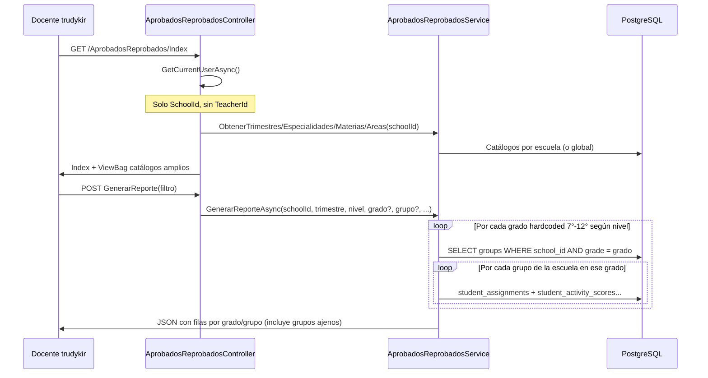

# Análisis forense: AprobadosReprobados/Index — docente con grupos/grados ajenos

**Fecha del análisis:** 2026-05-24  
**Modo:** Solo lectura (código + PostgreSQL PROD Render)  
**Usuario de referencia:** `trudykir@live.com` (GERTRUDIS KIRTON WINTER)  
**Restricciones respetadas:** Sin cambios de código, sin DML, sin índices, sin commit/push.

---

## Resumen ejecutivo

El reporte **Aprobados/Reprobados** está diseñado y implementado como un **reporte institucional por escuela**, no como un reporte **acotado al docente autenticado**. El controlador y el servicio solo propagan `SchoolId`; **nunca** consultan `TeacherId`, `teacher_assignments`, `user_groups` ni `user_subjects`.

Para `trudykir@live.com` la base de datos muestra **12 grupos** asignados vía `teacher_assignments` → `subject_assignments`, mientras la escuela tiene **28 grupos**. Al generar el reporte con nivel **Media** y “Todos los grados”, el backend itera **todos** los grupos de la escuela con `grade` en `10°`, `11°`, `12°` — **9 filas** en el reporte, incluyendo el grupo **F** (10°), que **no** pertenece a la docente.

**Veredicto:** El comportamiento reportado es **consistente con el código actual** (defecto de diseño / filtrado omitido), no un fallo aleatorio de datos ni duplicados en `teacher_assignments` para este usuario.

---

## Flujo encontrado

### Arquitectura de capas

| Capa | Artefacto | Rol |
|------|-----------|-----|
| Autorización | `[Authorize(Roles = "admin,director,teacher")]` en `AprobadosReprobadosController` | Docente puede entrar al módulo |
| Controlador | `Controllers/AprobadosReprobadosController.cs` | `Index`, `GenerarReporte`, exportaciones, APIs de catálogos |
| Servicio | `Services/Implementations/AprobadosReprobadosService.cs` | Lógica de reporte y estadísticas |
| Interfaz | `Services/Interfaces/IAprobadosReprobadosService.cs` | Contrato del servicio |
| Persistencia | `SchoolDbContext` (EF Core) directo en el servicio | **No hay repositorio dedicado** |
| Procedimientos almacenados | — | **No utilizados** en este flujo |
| ViewModels | `ViewModels/AprobadosReprobadosViewModel.cs` | Filtro, reporte, DTOs de fila/totales |
| Vista | `Views/AprobadosReprobados/Index.cshtml` | Filtros UI + AJAX a `GenerarReporte` |

### 1. Usuario autenticado

- **Login:** Claims (`ClaimTypes.NameIdentifier`, `ClaimTypes.Role`) vía ASP.NET Identity/cookies.
- **Resolución en app:** `ICurrentUserService.GetCurrentUserAsync()` → `Users.FindAsync(userId)` (`CurrentUserService.cs`).
- **En Index:** `var currentUser = await _currentUserService.GetCurrentUserAsync();` — se exige `currentUser.SchoolId`.

### 2. TeacherId

- **No se obtiene ni se usa** en `AprobadosReprobadosController` ni en `AprobadosReprobadosService` para filtros.
- En el modelo de datos, `teacher_assignments.teacher_id` = `users.id` del docente (mismo GUID).

### 3. SchoolId

- Origen: `currentUser.SchoolId` tras cargar el usuario desde BD.
- Se pasa a todas las operaciones: catálogos, `GenerarReporteAsync(schoolId, ...)`, exportaciones.

### 4. Grupos (reporte)

```csharp
var gruposQuery = _context.Groups
    .Where(g => g.SchoolId == schoolId && g.Grade == grado);
// opcional: .Where(g => g.Name == grupoEspecifico)
```

**Filtro efectivo:** escuela + grado textual (`groups.grade`) + nombre de grupo opcional. **Sin** vínculo a asignaciones del docente.

### 5. Grados (reporte)

- Lista **fija en código** (`ObtenerGradosPorNivel`):
  - Premedia → `7°`, `8°`, `9°`
  - Media → `10°`, `11°`, `12°`
- La vista **repite** la misma lista en JavaScript al cambiar el nivel (`Index.cshtml`).

### 6. Materias / áreas / especialidades (catálogos)

| Catálogo | Filtro |
|----------|--------|
| Trimestres | `trimesters` WHERE `school_id` |
| Especialidades | `specialties` WHERE `school_id` OR `school_id IS NULL` |
| Áreas | `areas` WHERE `is_active` (**global**, sin `school_id`) |
| Materias | `subjects` WHERE `school_id` AND `status = true` (+ filtros opcionales área/especialidad) |

**Ninguno** restringe por docente.

### 7. Estudiantes

```csharp
_context.StudentAssignments
    .Where(sa => sa.GroupId == grupoId && sa.IsActive)
```

Por cada grupo devuelto por la consulta anterior (toda la escuela en ese grado).

### 8. Aprobados / reprobados

Por estudiante activo del grupo:

1. Cargar `StudentActivityScores` + `Activity` + `Subject` + `Area` filtrados por trimestre (`TrimesterId` o texto `Trimester`), opcionalmente materia/área/especialidad.
2. Agrupar calificaciones por materia; promediar.
3. Reglas: ≥3 materias reprobadas → “reprobado”; alguna reprobada → “reprobado hasta la fecha”; si no hay reprobadas y promedio general ≥ 3.0 → “aprobado”; sin notas → “sin calificaciones”; `users.status` inactive/retirado → “retirado”.
4. **No** limita calificaciones a materias que imparte el docente; usa **todas** las actividades del trimestre del estudiante en ese grupo.

### Diagrama de flujo (login → reporte)



### Vista Razor / JavaScript

- **Grados en UI:** hardcoded en JS (7°–12°), no desde asignaciones del docente.
- **`GrupoEspecifico`:** existe en `AprobadosReprobadosFiltroViewModel` y el servicio lo soporta, pero **Index no expone** selector de grupo; solo “Todos los grados” o un grado.
- **Tabla de resultados:** construida en cliente desde JSON de `GenerarReporte`; no agrega filas extra — refleja lo que devuelve el backend.

---

## Estructura DB encontrada

### Cadena de asignación docente (canónica)

```
users (teacher)
  └── teacher_assignments (teacher_id → subject_assignment_id) [UNIQUE (teacher_id, subject_assignment_id)]
        └── subject_assignments (group_id, grade_level_id, subject_id, specialty_id, ...)
              ├── groups (name, grade, school_id)
              ├── grade_levels
              ├── subjects
              └── specialties
```

**Nota:** `teacher_assignments` **no** tiene columnas `group_id`, `grade_id` ni `is_active` directas.

### Tablas consultadas en el análisis (PROD, solo lectura)

| Tabla | Uso en módulo Aprobados/Reprobados |
|-------|-------------------------------------|
| `users` | Usuario actual; estudiantes (retirados) |
| `schools` | Nombre/logo del instituto |
| `groups` | **Fuente principal de filas del reporte** |
| `student_assignments` | Población por grupo |
| `student_activity_scores` | Calificaciones |
| `activities` | Trimestre, materia |
| `subjects`, `areas` | Filtros y joins |
| `subject_assignments` | Solo si filtro por especialidad |
| `trimesters` | Resolver `TrimesterId` |
| `teacher_assignments` | **No referenciada por el código del reporte** |
| `user_groups`, `user_subjects` | **No referenciadas** |
| `teacher_gradebooks` | **No referenciada** en este flujo |

---

## Datos reales del profesor

### Identidad

| Campo | Valor |
|-------|--------|
| `users.id` | `3f1d46b6-4849-4ae1-8535-930e8ed0f8b7` |
| Email | `trudykir@live.com` |
| Rol | `teacher` |
| Estado | `active` |
| `school_id` | `6e42399f-6f17-4585-b92e-fa4fff02cb65` |
| Escuela | Instituto Profesional y Técnico San Miguelito |

### A) Escuela

Una sola escuela activa asociada al usuario (tabla `schools` anterior).

### B) Grupos reales del docente (vía `teacher_assignments` → `subject_assignments`)

| Grupo | `groups.grade` | Materias en esa asignación |
|-------|----------------|----------------------------|
| G | 10° | CÍVICA |
| H | 10° | CÍVICA, GEOGRAFÍA |
| I | 11° | CÍVICA, GEOGRAFÍA |
| J | 11° | CÍVICA, GEOGRAFÍA |
| K | 11° | CÍVICA, GEOGRAFÍA |
| L | 12° | CÍVICA, GEOGRAFÍA |
| M | 12° | GEOGRAFÍA |
| N | 12° | GEOGRAFÍA |
| A2 | 7° | GEOGRAFÍA DE PANAMÁ |
| C2 | 8° | GEOGRAFÍA DE PANAMÁ |
| E2 | 9° | GEOGRAFÍA DE PANAMÁ |
| Ñ | *(vacío)* | GEOGRAFÍA |

**Total grupos distintos del docente: 12** (17 filas de asignación materia×grupo).

### C) Grados reales (derivados de grupos asignados)

`7°`, `8°`, `9°`, `10°`, `11°`, `12°` y un grupo sin grado (`Ñ`).

### D) Materias reales

| `subjects.id` | Nombre |
|---------------|--------|
| `6592de4d-...` | CÍVICA |
| `f1024428-...` | GEOGRAFÍA |
| `1d498f07-...` | GEOGRAFÍA DE PANAMÁ |

### E) Duplicados en `teacher_assignments`

**Ninguno** (`HAVING COUNT(*) > 1` → 0 filas). Existe índice único `(teacher_id, subject_assignment_id)` en el modelo EF.

### F) Registros huérfanos (docente)

- `user_groups`: **0 filas** para este usuario.
- `user_subjects`: **0 filas**.

No hay asignación paralela por esas tablas que explique grupos extra.

### G) Relaciones M:N incorrectas (docente)

No se detectaron duplicados en `teacher_assignments`. Las 17 filas son combinaciones legítimas materia×grupo (p. ej. CÍVICA y GEOGRAFÍA en el mismo grupo H).

### H) Grupos indirectos

El reporte **no** usa asignaciones; incluye grupos por pertenencia a la **escuela** únicamente → todos los grupos del grado son “indirectos” respecto al docente salvo los 12 listados.

### I) Datos históricos mezclándose

- `student_assignments` filtra `is_active = true`.
- No hay filtro por año lectivo en grupos ni asignaciones en este módulo.
- Actividades: filtro por trimestre seleccionado, no por docente.
- **Riesgo secundario:** grupo **H** duplicado en la escuela (uno con `grade = 10°`, otro con `grade` NULL, IDs distintos). El docente tiene el **H** de 10°; el otro **H** sin grado podría aparecer en escenarios sin filtro de grado (p. ej. datos inconsistentes).

### J) Grupos compartidos entre docentes

Esperado en modelo escolar: mismo `groups.id` puede tener varios docentes vía distintos `subject_assignments`. El reporte muestra el grupo **completo** (todos los estudiantes y **todas** las materias con nota en el trimestre), no solo la materia del docente.

### Contraste escuela vs docente (conteo por grado)

| Grado | Grupos escuela | Grupos docente | Extra en reporte (si se incluye todo el grado) |
|-------|----------------|----------------|------------------------------------------------|
| 10° | 3 | 2 | **1** (grupo **F**) |
| 11° | 3 | 3 | 0 |
| 12° | 3 | 3 | 0 |
| 7° | 3 | 1 | **2** (A, A1) |
| 8° | 4 | 1 | **3** (B, C, C1) |
| 9° | 4 | 1 | **3** (D, E, E1) |
| sin grado | 8 | 1 | **7** |

**Grupos en escuela que NO son del docente: 16** (incluye F, A, A1, B, C, C1, D, E, E1, H sin grado, O, P, S, S1, S2, TM1).

### Calidad de datos observada (secundaria)

- `subject_assignments.grade_level_id` a veces no coincide con `groups.grade` (ej. grupo 10° con `grade_levels.name` = 9 / PRE-MEDIA). **No** es la causa principal del síntoma (el reporte ignora `teacher_assignments`).

---

## Consultas encontradas

### Index (GET) — consultas EF aproximadas

1. `Users` por PK (usuario actual).
2. `Trimesters` WHERE `SchoolId`.
3. `Specialties` WHERE `SchoolId` OR NULL.
4. `Areas` WHERE `IsActive`.
5. `Subjects` WHERE `SchoolId` AND `Status`.

### GenerarReporte — LINQ principal

```csharp
// Pseudocódigo equivalente al servicio
var grados = nivel == "premedia" ? ["7°","8°","9°"] : ["10°","11°","12°"];
foreach (var grado in grados) {
  if (gradoEspecifico != null && grado != gradoEspecifico) continue;
  var grupos = await Groups
    .Where(g => g.SchoolId == schoolId && g.Grade == grado)
    .Where(g => grupoEspecifico == null || g.Name == grupoEspecifico)
    .ToListAsync();
  foreach (var grupo in grupos) {
    await CalcularEstadisticasGrupoAsync(grupo.Id, ...);
  }
}
```

### CalcularEstadisticasGrupoAsync — por grupo

1. `StudentAssignments` → IDs estudiantes activos.
2. `Users` → status retirado.
3. `StudentActivityScores` `.Include(Activity).ThenInclude(Subject).ThenInclude(Area)` con filtros trimestre/materia/área/especialidad.
4. Si especialidad: subconsulta `SubjectAssignments` por `SpecialtyId`.

**Ausencias críticas en LINQ:**

- `WHERE TeacherId = @currentUserId` — **ausente**
- `WHERE GroupId IN (asignaciones del docente)` — **ausente**
- `WHERE SubjectId IN (materias del docente)` — **ausente** (salvo filtro manual del usuario en UI)
- `DISTINCT` en grupos — innecesario si la query de grupos ya es por PK, pero la **cardinalidad** es “todos los grupos del grado”
- Filtro por rol distinto a teacher — **ausente** (mismo código para admin/director/teacher)

---

## SQL generado (aproximado)

### Selección de grupos para Media, grado 10°, escuela San Miguelito

```sql
SELECT g.id, g.name, g.grade
FROM groups g
WHERE g.school_id = '6e42399f-6f17-4585-b92e-fa4fff02cb65'
  AND g.grade = '10°';
-- Resultado esperado en PROD: F, G, H (3 filas)
-- Docente solo debería ver: G, H (2 filas)
```

### Equivalente a estadísticas de un grupo

```sql
-- Estudiantes
SELECT DISTINCT sa.student_id
FROM student_assignments sa
WHERE sa.group_id = :grupoId AND sa.is_active = true;

-- Calificaciones (simplificado)
SELECT sas.*
FROM student_activity_scores sas
JOIN activities a ON a.id = sas.activity_id
JOIN subjects sub ON sub.id = a.subject_id
WHERE sas.student_id = ANY(:estudiantes)
  AND (a.trimester_id = :trimesterId OR a.trimester = :trimestre);
```

### SQL forense ejecutado (script)

Archivo: `Scripts/forensic_trudykir_aprobados.sql` (solo `SELECT`, ejecutado contra PROD Render el 2026-05-24).

---

## Diferencias detectadas (simulación manual)

**Escenario:** Login `trudykir@live.com` → Dashboard → `AprobadosReprobados/Index` → generar reporte.

### Tabla comparativa — Nivel **Media**, “Todos los grados”

| Tipo | Valor esperado (solo asignaciones docente) | Valor actual (código) | Diferencia | Posible causa |
|------|--------------------------------------------|-------------------------|------------|---------------|
| Filas reporte 10° | G, H | F, G, H | **+F** | `Groups` filtrado solo por `school_id` + `grade` |
| Filas reporte 11° | I, J, K | I, J, K | — | Coincidencia accidental |
| Filas reporte 12° | L, M, N | L, M, N | — | Coincidencia accidental |
| **Total filas Media** | **8** | **9** | **+1** | Sin filtro docente |
| Opciones grado UI | Solo 10°, 11°, 12° (tiene asignación) | 10°, 11°, 12° (todos del nivel) | Mismo set en Media | JS hardcoded por nivel, no por docente |
| Opciones grado Premedia UI | 7°, 8°, 9° (tiene asignación en los tres) | 7°, 8°, 9° | Mismo set | Hardcoded; al elegir “Todos” incluye grupos A, B, C… no asignados |
| Materias dropdown | CÍVICA, GEOGRAFÍA, GEOGRAFÍA DE PANAMÁ | Todas las materias activas de la escuela | Puede incluir materias que no imparte | `ObtenerMateriasAsync(schoolId)` |
| Coordinador en PDF | Nombre docente | Nombre docente | — | Solo etiqueta; no implica filtrado |
| Estadísticas por grupo | Solo sus estudiantes/materias | Todos los estudiantes; **todas** las materias con nota en trimestre | Métricas de otros docentes mezcladas | `CalcularEstadisticasGrupoAsync` sin acotar materias |

### Tabla — Nivel **Premedia**, “Todos los grados”

| Grado | Esperado (docente) | Actual (escuela) | Extra |
|-------|-------------------|------------------|-------|
| 7° | A2 | A, A1, A2 | A, A1 |
| 8° | C2 | B, C, C1, C2 | B, C, C1 |
| 9° | E2 | D, E, E1, E2 | D, E, E1 |
| **Total Premedia** | **3** | **11** | **+8** |

### Tabla — Media, grado **10°** únicamente

| Tipo | Esperado | Actual | Diferencia | Causa |
|------|----------|--------|------------|-------|
| Grupos | G, H | F, G, H | +F | Misma query con `grade = '10°'` |

---

## Evidencias

### Evidencia E1 — Código: solo `SchoolId` en generación de reporte

`AprobadosReprobadosController.GenerarReporte` (líneas 95–104): parámetros a servicio son `currentUser.SchoolId.Value` y filtros del formulario; **no** `currentUser.Id` ni rol.

### Evidencia E2 — Servicio: grupos por escuela

`AprobadosReprobadosService.cs` líneas 68–76: `_context.Groups.Where(g => g.SchoolId == schoolId && g.Grade == grado)`.

### Evidencia E3 — PROD: grupo F no asignado al docente

Consulta “GRUPOS EXTRA”: incluye `b58aca68-... | F | 10°` mientras las asignaciones del docente en 10° son solo G y H.

### Evidencia E4 — PROD: sin `user_groups` / `user_subjects`

0 filas — descarta explicación por tablas auxiliares mal pobladas **para este usuario**.

### Evidencia E5 — PROD: sin duplicados `teacher_assignments`

Confirma integridad de asignaciones; el problema no es duplicación.

### Evidencia E6 — UI: grados hardcoded

`Index.cshtml` ~187–194: opciones 7°–12° por nivel sin llamada al backend de asignaciones.

### Evidencia E7 — Mismo comportamiento para admin y teacher

Misma acción `GenerarReporteAsync` para roles `admin`, `director`, `teacher`; para docente no hay rama restrictiva.

---

## Hipótesis ordenadas por probabilidad

| # | Hipótesis | Prob. | Validación |
|---|-----------|-------|------------|
| 1 | **Filtro por docente omitido en backend** (`SchoolId` únicamente) | **Muy alta** | Código + SQL PROD (16 grupos extra) |
| 2 | **Diseño intencional “reporte coordinación escolar”** mal expuesto a rol `teacher` | Alta | Mismo endpoint para admin/director/teacher; etiqueta “Profesor coordinador” |
| 3 | **UI muestra todos los grados del nivel**, no los del docente | Alta | JS hardcoded |
| 4 | **Estadísticas usan todas las materias del trimestre**, no solo las del docente | Media-alta | `CalcularEstadisticasGrupoAsync` sin `SubjectId` del docente |
| 5 | Datos: grupos sin `grade` (8 en escuela) | Media (secundaria) | Pueden afectar otros filtros; docente tiene Ñ sin grado |
| 6 | `user_groups` / `user_subjects` incorrectos | **Descartada** | 0 filas para este usuario |
| 7 | Duplicados `teacher_assignments` | **Descartada** | 0 duplicados |
| 8 | Include() excesivo / JOIN incorrecto causando filas fantasma | Baja | Includes no multiplican filas del reporte; el bucle es explícito por `Groups` |
| 9 | Bug JavaScript agregando filas | **Descartada** | Tabla renderiza JSON del servidor |
| 10 | Caché | Baja | No hay capa de caché en servicio para este reporte |
| 11 | Procedimiento almacenado erróneo | **N/A** | No se usa SP |
| 12 | Histórico mezclado | Baja-media | Sin filtro año lectivo; `is_active` sí aplica |

### Checklist solicitado

| Ítem | ¿Aplica? |
|------|----------|
| TeacherAssignments duplicados | No |
| UserGroups incorrectos | No (vacío) |
| UserSubjects incorrectos | No (vacío) |
| StudentAssignments incorrectos | No evidenciado como causa de *lista* de grupos |
| Filtros omitidos | **Sí — causa principal** |
| SchoolId omitido | No (se usa) |
| Include() relaciones extras | No causa grupos extra |
| Navegación EF incorrecta | No |
| Cache | No identificado |
| Consultas sin DISTINCT | No relevante |
| Relaciones históricas | Posible impacto menor en métricas |
| Problema ViewModel | No |
| Problema JavaScript | No (solo catálogo grados hardcoded) |
| Problema Razor | Parcial (UX grados) |
| Problema backend | **Sí** |
| Problema SQL | Consecuencia del LINQ |
| Problema datos | Secundario (F extra, H duplicado sin grado) |

---

## Riesgos

1. **Privacidad / cumplimiento:** Docente ve rendimiento agregado de grupos y estudiantes que no tiene a su cargo.
2. **Decisiones pedagógicas erróneas:** Totales mezclan calificaciones de todas las materias.
3. **Confianza del usuario:** Síntoma visible (“veo grupos que no son míos”).
4. **Rendimiento:** Con “Todos los grados” en Media se procesan 9 grupos × (2–3 consultas + Include pesado); en Premedia 11 grupos; peor si escuela crece.
5. **Ambigüedad de nombres:** Dos grupos `H` (uno con grado, uno sin) si algún día se filtra solo por `Name`.
6. **Rol teacher con permisos de reporte global:** Superficie de autorización demasiado amplia.

---

## Recomendaciones (sin aplicar)

### Funcionales

1. Para `role == teacher`, restringir grupos a:
   ```text
   DISTINCT subject_assignments.group_id
   FROM teacher_assignments
   WHERE teacher_id = @userId
   ```
2. Restringir grados del dropdown a grados presentes en esas asignaciones.
3. Restringir materias/especialidades del docente de forma similar.
4. En `CalcularEstadisticasGrupoAsync`, opcionalmente filtrar `SubjectId` a materias del docente en ese grupo (si el reporte debe ser “mis materias”).
5. Mantener comportamiento actual para `admin`/`director` (reporte institucional completo).
6. Exponer selector de **grupo** en UI o eliminar `GrupoEspecifico` del contrato si no se usa.

### Datos

7. Normalizar `groups.grade` en los 8 grupos sin grado (incluye Ñ del docente).
8. Revisar duplicado nombre **H** (IDs `f3ecb2b9-...` vs `2ad7f86c-...`).
9. Alinear `grade_levels` con `groups.grade` en `subject_assignments`.

### Rendimiento (solo documentación)

10. Evitar N+1: precargar estudiantes y scores de todos los `group_id` del conjunto filtrado en una o dos consultas.
11. Sustituir `.Include` completo por proyección (`Select`) si solo se necesitan `SubjectId`, `Score`, `TrimesterId`.
12. Índices sugeridos para revisión futura (no creados en este análisis): `(groups.school_id, groups.grade)`, `(student_assignments.group_id, is_active)`, `(student_activity_scores.student_id)` + FK activities.

### QA

13. Casos de prueba por rol: teacher con 2 grupos en 10° no debe ver F.
14. Reutilizar `Scripts/forensic_trudykir_aprobados.sql` como plantilla de auditoría.

---

## Rendimiento (Fase 6)

| Aspecto | Observación |
|---------|-------------|
| Patrón | **N+1 por grupo:** 1 query grupos + por cada grupo: assignments, users, scores (+ posible query especialidad) |
| Media “todos los grados” | ~9 iteraciones → ~18–27 round-trips EF |
| Premedia “todos” | ~11 iteraciones |
| Includes | `StudentActivityScores` → Activity → Subject → Area carga grafo amplio en memoria |
| Volumen docente | 17 asignaciones, 12 grupos — pequeño; el costo escala con **grupos de escuela** (28), no con asignaciones del docente |
| SP / raw SQL | No |

---

## Veredicto final

**Causa raíz:** El módulo `AprobadosReprobados` implementa un **reporte por escuela y por grado académico**, autorizado también para el rol `teacher`, **sin restringir** grupos (ni grados en UI) a las asignaciones reales del docente en `teacher_assignments`.

Para **trudykir@live.com**, la evidencia en PROD cuantifica el desvío: **16 grupos** de la escuela aparecerían en reportes amplios que no están en sus asignaciones; el caso más visible en **Media 10°** es el grupo **F**, que la docente no tiene asignado pero el sistema incluye junto con **G** y **H**.

**No se requiere corrección de datos** para reproducir el bug; la corrección sería de **lógica de autorización y filtrado** (fuera del alcance de este documento, por instrucción de solo análisis).

---

## Anexos

### Archivos revisados

- `Controllers/AprobadosReprobadosController.cs`
- `Services/Implementations/AprobadosReprobadosService.cs`
- `Services/Interfaces/IAprobadosReprobadosService.cs`
- `Services/Implementations/CurrentUserService.cs`
- `ViewModels/AprobadosReprobadosViewModel.cs`
- `Views/AprobadosReprobados/Index.cshtml`
- `Scripts/forensic_trudykir_aprobados.sql`
- `Scripts/CombinacionesReporteAprobadosReprobados.sql` (referencia de diseño escuela-wide)

### Conexión utilizada

- Cliente: `C:\Program Files\PostgreSQL\18\bin\psql.exe`
- Host: `dpg-d3jfdcb3fgac73cblbag-a.oregon-postgres.render.com` (Render PROD)
- Base: `schoolmanagement_xqks`
- Operaciones: únicamente `SELECT` / `\echo`

---

*Documento generado en modo forense. No se modificó código ni datos de producción.*
