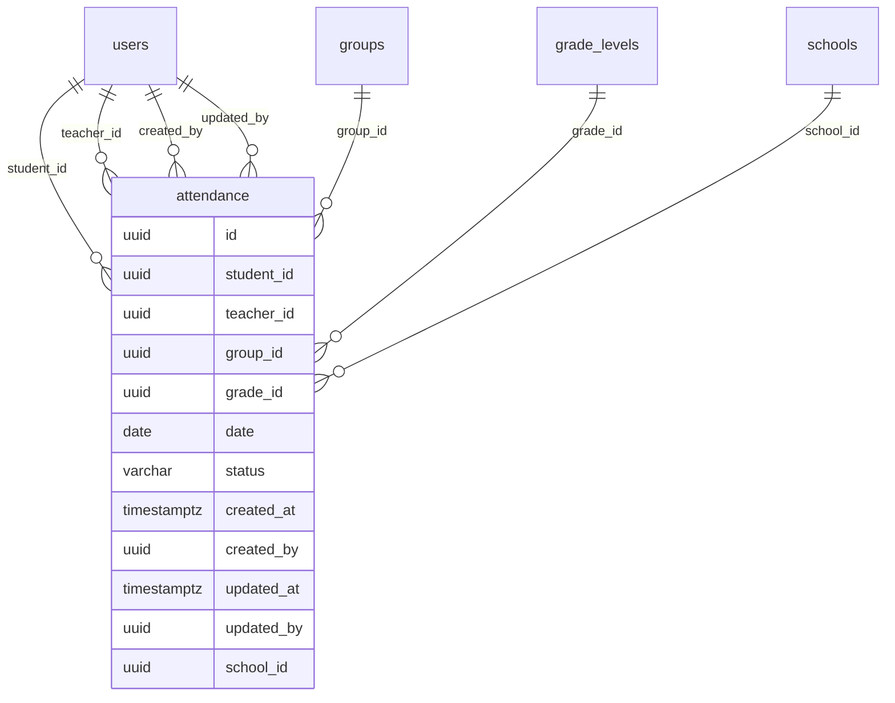

# Análisis funcional y técnico del módulo de asistencia

**Proyecto:** `C:\Proyectos\EduplanerIIC\SchoolManager`  
**Base de datos:** Render Producción  
**Cliente PostgreSQL:** `C:\Program Files\PostgreSQL\18\bin`  
**Alcance:** Solo análisis. No se modificó código, no se modificaron datos, no se crearon migraciones, no hubo commit ni push.

---

## 1. Conclusión ejecutiva

El módulo de asistencia **no está diseñado como asistencia por materia** de forma persistente. La tabla principal `attendance` guarda asistencia por:

- estudiante
- docente
- grupo
- grado
- fecha
- estado

Pero **no guarda directamente**:

- materia (`subject_id`)
- trimestre (`trimester_id` o `trimester`)
- año académico (`academic_year_id`)

El trimestre y el año académico se calculan indirectamente por rango de fechas. La materia aparece en la UI de `TeacherGradebook` como parte del selector “Materia, Grado y Grupo”, pero **el `subjectId` se descarta al guardar** y no llega al modelo `Attendance`.

Resultado: el diseño permite responder asistencia por estudiante/docente/grupo/fecha, pero **no garantiza asistencia académica por materia**.

---

## 2. Respuestas críticas

| Pregunta | Respuesta | Evidencia |
|---|---:|---|
| ¿Quién registra la asistencia? | Principalmente el docente desde `/TeacherGradebook/Index`; también existe un CRUD genérico `/Attendance`. | `TeacherGradebookController.SaveAttendances`, `AttendanceController.SaveAttendances`, vistas `TeacherGradebook/Index.cshtml` y `Attendance/*`. |
| ¿Qué profesor queda asociado? | Sí, `teacher_id`. | `Attendance.TeacherId`, FK `attendance_teacher_id_fkey`. |
| ¿Qué materia queda asociada? | **No queda asociada en BD.** | `AttendanceSaveDto` no tiene `SubjectId`; tabla `attendance` no tiene `subject_id`. |
| ¿Qué grupo queda asociado? | Sí, `group_id`. | `Attendance.GroupId`, FK a `groups.id`. |
| ¿Qué trimestre queda asociado? | No directo. Se deriva por fecha contra `trimester.start_date/end_date`. | `Attendance` no tiene trimester; estadísticas reciben `Trimestre` pero filtran por fechas. |
| ¿Qué año académico queda asociado? | No directo. Se deriva por fecha contra `academic_years.start_date/end_date`. | `Attendance` no tiene `academic_year_id`. |
| ¿Qué estudiante queda asociado? | Sí, `student_id`. | FK a `users.id`. |
| ¿Se puede auditar quién la creó? | Modelo sí, datos reales no. | Columnas `created_by`, `created_at`; en producción `created_by` = 0 registros poblados. |
| ¿Se puede auditar quién la modificó? | Modelo sí, datos reales no. | Columnas `updated_by`, `updated_at`; en producción `updated_by` = 0 registros poblados. |
| ¿Se puede calcular asistencia por materia? | **No confiablemente.** | Falta `subject_id`; inferencia por asignaciones es ambigua. |
| ¿Se puede calcular asistencia por profesor? | Sí. | `teacher_id` poblado en 32,297/32,297 registros. |
| ¿Se puede calcular asistencia por trimestre? | Parcialmente, por fecha. | 6,426 registros quedan fuera de cualquier trimestre configurado. |
| ¿Se puede calcular asistencia anual? | Sí, por fecha. | 32,297 registros caen dentro del año académico 2026. |

---

## 3. Modelo real de asistencia

### Modelo esperado por regla académica

```text
Profesor
  ↓
Materia
  ↓
Grupo
  ↓
Fecha
  ↓
Estudiante
  ↓
Estado de asistencia
```

### Modelo real persistido

```text
Profesor
  ↓
Grupo + Grado
  ↓
Fecha
  ↓
Estudiante
  ↓
Estado de asistencia
```

La materia está presente en el selector visual, pero no se persiste. Por eso el diseño real es más cercano a **asistencia por docente-grupo-fecha-estudiante** que a asistencia por clase/materia.

---

## 4. Controladores y endpoints

### `AttendanceController`

Archivo: `Controllers/AttendanceController.cs`

```text
AttendanceController
 ├── Index()                         GET
 ├── Details(Guid id)                GET
 ├── Create()                        GET
 ├── Create(Attendance attendance)   POST
 ├── Edit(Guid id)                   GET
 ├── Edit(Attendance attendance)     POST
 ├── Delete(Guid id)                 GET
 ├── DeleteConfirmed(Guid id)        POST
 ├── SaveAttendances(List<AttendanceSaveDto>) POST JSON
 ├── Historial(HistorialAsistenciaFiltroDto)  POST JSON
 └── Estadisticas(EstadisticasFiltroDto)      POST JSON
```

Observaciones:

- No tiene `[Authorize]` a nivel de controller en el archivo analizado.
- No tiene `[ValidateAntiForgeryToken]` en los POST JSON.
- El CRUD `Create/Edit` recibe directamente `Attendance`, pero la vista `Create` solo expone `Date` y `Status`; no pide estudiante/docente/grupo/grado.

### `TeacherGradebookController`

Archivo: `Controllers/TeacherGradebookController.cs`

```text
TeacherGradebookController [Authorize(Roles = "teacher")]
 ├── Index()                         GET /TeacherGradebook/Index
 ├── StudentsByGroupAndGrade(...)     GET JSON
 ├── SaveAttendances(...)             POST JSON
 └── GetAttendancesByDate(...)        GET JSON
```

Evidencia clave:

- Inyecta `IAttendanceService`.
- `Index()` arma el selector de materias/grupos desde asignaciones docentes.
- `SaveAttendances()` delega en `_attendanceService.SaveAttendancesAsync`.
- `GetAttendancesByDate()` delega en `_attendanceService.GetAttendancesByDateAsync`.

---

## 5. Servicios y DTOs

### `IAttendanceService`

Archivo: `Services/Interfaces/IAttendanceService.cs`

Métodos:

- `GetAllAsync`
- `GetByIdAsync`
- `CreateAsync`
- `UpdateAsync`
- `DeleteAsync`
- `GetByStudentAsync`
- `GetHistorialAsync`
- `GetEstadisticasAsync`
- `SaveAttendancesAsync`
- `GetAttendancesByDateAsync`
- `GetHistorialAsistenciaAsync`

### `AttendanceService`

Archivo: `Services/Implementations/AttendanceService.cs`

#### Creación genérica

`CreateAsync(Attendance attendance)` sí llama:

- `AuditHelper.SetAuditFieldsForCreateAsync`
- `AuditHelper.SetSchoolIdAsync`

Pero este flujo **no es el flujo principal usado por TeacherGradebook**.

#### Guardado masivo desde TeacherGradebook

`SaveAttendancesAsync(List<AttendanceSaveDto>)` crea siempre registros nuevos:

```csharp
var attendance = new Attendance
{
    Id = Guid.NewGuid(),
    StudentId = dto.StudentId,
    TeacherId = dto.TeacherId,
    GroupId = dto.GroupId,
    GradeId = dto.GradeId,
    Date = dto.Date,
    Status = dto.Status,
    CreatedAt = DateTime.UtcNow
};
```

Limitaciones de este flujo:

- No guarda `SchoolId`.
- No guarda `CreatedBy`.
- No guarda `UpdatedBy`.
- No valida que `TeacherId` del DTO sea el usuario autenticado.
- No busca registro existente por estudiante/docente/grupo/grado/fecha.
- No hace upsert; si se guarda dos veces, puede duplicar.
- No recibe ni guarda `SubjectId`.

### `AttendanceSaveDto`

Archivo: `Dtos/AttendanceSaveDto.cs`

```text
StudentId
TeacherId
GroupId
GradeId
Date
Status
```

No existe `SubjectId`, `TrimesterId`, `AcademicYearId` ni `SchoolId`.

---

## 6. Vista `/TeacherGradebook/Index`

Archivo: `Views/TeacherGradebook/Index.cshtml`

La vista sí muestra pestaña de asistencia:

```text
Módulo de Asistencia
 ├── Tomar Asistencia
 ├── Historial
 └── Estadísticas
```

### Selector visual

El combo usa:

```text
subjectId|groupId|gradeLevelId
```

Ejemplo de construcción:

```csharp
var value = $"{subject.SubjectId}|{group.GroupId}|{group.GradeLevelId}";
var text = $"{subject.SubjectName} - {group.GradeLevelName} - {group.GroupName}";
```

### Guardado real

Al guardar asistencia, el JS separa el combo:

```javascript
const [subjectId, groupId, gradeLevelId] = combo.split('|');
```

Pero al construir el payload, **no incluye `subjectId`**:

```javascript
attendances.push({
    studentId: studentId,
    teacherId: teacherId,
    groupId: groupId,
    gradeId: gradeLevelId,
    date: fecha,
    status: status
});
```

Por lo tanto, TeacherGradebook usa la materia para cargar estudiantes filtrados, pero la asistencia guardada queda sin materia.

### Bloque JS obsoleto

La vista contiene además un bloque antiguo que llama:

```javascript
url: '/TeacherGradebook/GetAsistencias'
```

Ese endpoint **no existe** en `TeacherGradebookController`. Sí existe un método similar en `OrientationReportController`. Esto indica deuda técnica o código muerto en la vista.

---

## 7. Base de datos

### Tabla principal

Tabla: `attendance`

Columnas reales en producción:

| Columna | Tipo | Nullable | Default |
|---|---|---:|---|
| `id` | uuid | NO | `uuid_generate_v4()` |
| `student_id` | uuid | YES |  |
| `teacher_id` | uuid | YES |  |
| `group_id` | uuid | YES |  |
| `grade_id` | uuid | YES |  |
| `date` | date | NO |  |
| `status` | character varying | NO |  |
| `created_at` | timestamp with time zone | YES | `CURRENT_TIMESTAMP` |
| `created_by` | uuid | YES |  |
| `updated_by` | uuid | YES |  |
| `updated_at` | timestamp with time zone | YES |  |
| `school_id` | uuid | YES |  |

### FK reales

| Constraint | Columna | Tabla destino |
|---|---|---|
| `attendance_student_id_fkey` | `student_id` | `users.id` |
| `attendance_teacher_id_fkey` | `teacher_id` | `users.id` |
| `attendance_group_id_fkey` | `group_id` | `groups.id` |
| `attendance_grade_id_fkey` | `grade_id` | `grade_levels.id` |
| `fk_attendance_school` | `school_id` | `schools.id` |
| `fk_attendance_created_by` | `created_by` | `users.id` |
| `fk_attendance_updated_by` | `updated_by` | `users.id` |

No existen FK a:

- `subjects`
- `subject_assignments`
- `teacher_assignments`
- `student_assignments`
- `academic_years`
- `trimester`
- `activities`

### Índices reales

| Índice | Columna |
|---|---|
| `attendance_pkey` | `id` |
| `IX_attendance_student_id` | `student_id` |
| `IX_attendance_teacher_id` | `teacher_id` |
| `IX_attendance_group_id` | `group_id` |
| `IX_attendance_grade_id` | `grade_id` |

No existe índice compuesto para evitar duplicados como:

```text
student_id + teacher_id + group_id + grade_id + date
```

---

## 8. Diagrama relacional real



Relaciones ausentes:

```text
attendance -X-> subjects
attendance -X-> trimester
attendance -X-> academic_years
attendance -X-> activities
attendance -X-> student_assignments
```

---

## 9. Evidencia de producción

Todas las consultas fueron `SELECT`.

### 9.1 Totales

```text
total attendance = 32,297
```

### 9.2 Completitud de campos críticos

| Campo | Registros con valor | Registros sin valor |
|---|---:|---:|
| `teacher_id` | 32,297 | 0 |
| `student_id` | 32,297 | 0 |
| `group_id` | 32,297 | 0 |
| `grade_id` | 32,297 | 0 |
| `school_id` | 0 | 32,297 |
| `created_by` | 0 | 32,297 |
| `updated_by` | 0 | 32,297 |

### 9.3 Cantidad por estado

| Estado | Registros |
|---|---:|
| `present` | 24,958 |
| `absent` | 5,879 |
| `fuga` | 659 |
| `late` | 614 |
| `excusa` | 187 |

### 9.4 Top profesores que registran asistencia

| Profesor | Registros |
|---|---:|
| GERTRUDIS KIRTON WINTER | 6,035 |
| Fabio Alexander Ortíz Yee | 4,125 |
| GUILLERMO MORALES | 2,645 |
| Jessica Singh | 2,357 |
| VERONICA JONES DE RAMOS | 1,777 |
| YULISSA MAIDETH LÓPEZ FERNÁNDEZ | 1,552 |
| Ronaldo Barría Trujillo | 1,453 |
| JACQUELINE MARTINEZ | 1,289 |
| ROBERTO WRIGHT | 1,202 |
| Jilma Esther Jimenez Pérez | 1,188 |

### 9.5 Top grupos

| Grupo | Registros |
|---|---:|
| Ñ | 4,286 |
| I | 2,731 |
| G | 2,476 |
| L | 2,430 |
| J | 1,835 |
| E1 | 1,788 |
| K | 1,660 |
| E2 | 1,555 |
| H | 1,436 |
| M | 1,298 |

### 9.6 Cantidad por grado

| Grado | Registros |
|---|---:|
| 7 | 11,691 |
| 9 | 7,969 |
| 8 | 5,583 |
| 10 | 2,606 |
| 12 | 2,520 |
| 11 | 1,928 |

### 9.7 Cantidad por trimestre derivado por fecha

| Trimestre | Registros |
|---|---:|
| 1T | 25,860 |
| 2T | 11 |
| 3T | 0 |

Registros fuera de cualquier trimestre configurado: **6,426**.

Rango de fechas real:

```text
min_date = 2026-03-02
max_date = 2026-09-10
```

### 9.8 Cantidad por año académico derivado por fecha

| Año académico | Registros |
|---|---:|
| 2026 | 32,297 |

### 9.9 Materias inferidas

No existe conteo directo por materia. La única forma fue intentar inferir materia por:

```text
attendance.teacher_id
  → teacher_assignments.teacher_id
  → subject_assignments.id
  → subject_assignments.group_id + grade_level_id
  → subjects.id
```

Resultado de ambigüedad:

| Cantidad de materias posibles por registro | Registros |
|---:|---:|
| 1 | 30,354 |
| 2 | 1,316 |
| 4 | 616 |
| 5 | 11 |

Esto significa que **1,943 registros** tienen más de una materia posible por inferencia. Por tanto, la asistencia por materia no es plenamente confiable.

Top materias inferidas solo donde hay una única materia posible:

| Materia inferida | Registros |
|---|---:|
| ESPAÑOL | 4,683 |
| CÍVICA | 4,530 |
| GEOGRAFÍA | 3,128 |
| MATEMÁTICAS | 2,787 |
| CIENCIAS NATURALES | 2,429 |
| ARTES INDUSTRIALES | 2,387 |
| INGLÉS | 2,249 |
| HISTORIA | 2,171 |
| INGLES | 1,552 |
| RELIGIÓN, MORAL Y VALORES | 1,285 |

### 9.10 Duplicados por clave académica

Clave evaluada:

```text
student_id + teacher_id + group_id + grade_id + date
```

Resultado:

| Métrica | Valor |
|---|---:|
| Claves duplicadas | 5,830 |
| Filas involucradas en duplicados | 14,643 |

Esto sugiere que guardar asistencia varias veces para la misma fecha/grupo/docente/estudiante puede crear registros repetidos.

---

## 10. Relación con TeacherGradebook

### ¿TeacherGradebook consume asistencia?

Sí. Usa `IAttendanceService` para:

- cargar asistencias por fecha (`GetAttendancesByDate`)
- guardar asistencias (`SaveAttendances`)

### ¿TeacherGradebook registra asistencia?

Sí. La pestaña “Asistencias” en `/TeacherGradebook/Index` permite marcar estados y guardar por AJAX a:

```text
POST /TeacherGradebook/SaveAttendances
```

### ¿TeacherGradebook consulta asistencia?

Sí. Consulta por fecha:

```text
GET /TeacherGradebook/GetAttendancesByDate?groupId=...&gradeId=...&date=...
```

### ¿TeacherGradebook muestra asistencia?

Sí, en la pestaña “Asistencias”, subpestañas:

- Tomar Asistencia
- Historial
- Estadísticas

### ¿TeacherGradebook calcula porcentajes?

No directamente en el controller. La vista llama:

```text
POST /Attendance/Estadisticas
```

Ese endpoint calcula porcentajes con `AttendanceService.GetEstadisticasAsync`.

### ¿TeacherGradebook mezcla asistencia con notas?

En UI sí conviven dentro del mismo `TeacherGradebook/Index`, pero en persistencia no se mezclan:

- notas: `activities`, `student_activity_scores`
- asistencia: `attendance`

No hay FK entre `attendance` y `activities` / `student_activity_scores`.

### ¿TeacherGradebook utiliza `AttendanceService`?

Sí. Lo inyecta como `IAttendanceService _attendanceService` y lo usa en:

- `SaveAttendances`
- `GetAttendancesByDate`

---

## 11. Análisis funcional de preguntas reales

### ¿Cuál fue la asistencia de Juan Pérez en Matemáticas durante 2T?

**No de forma confiable.**

Se puede obtener asistencia de Juan Pérez durante 2T por fecha, pero no en Matemáticas, porque `attendance` no guarda `subject_id`.

Solo podría inferirse si para ese docente/grupo/grado existe una única materia posible, lo cual no siempre ocurre.

### ¿Cuál fue la asistencia registrada por el profesor Carlos Rodríguez en Matemáticas?

**Por profesor sí; por profesor + materia no confiable.**

La asistencia tiene `teacher_id`, pero no `subject_id`. Si el profesor tiene varias materias para el mismo grupo/grado, la consulta queda ambigua.

### ¿Cuál fue el porcentaje de asistencia de un estudiante durante el trimestre?

**Sí, parcialmente.**

Se puede calcular:

```text
attendance.student_id + attendance.date BETWEEN trimester.start_date/end_date
```

Pero como el trimestre no está persistido en el registro, depende de rangos de fecha configurados. En producción hay 6,426 registros fuera de trimestres configurados.

### ¿Cuál fue el porcentaje de asistencia de un grupo?

**Sí.**

Se puede calcular por `group_id`, `grade_id` y rango de fechas.

### ¿Cuál fue el porcentaje de asistencia por materia?

**No confiablemente.**

Falta `subject_id` en `attendance`.

---

## 12. Calidad del diseño

| Dimensión | Puntaje | Evaluación |
|---|---:|---|
| Diseño académico | 55/100 | Guarda estudiante/docente/grupo/fecha, pero falta materia, trimestre y año académico persistidos. |
| Escalabilidad | 60/100 | Índices básicos existen, pero no hay índice por fecha ni compuesto para consultas reales. |
| Auditoría | 35/100 | Columnas existen, pero el flujo principal no las llena; producción tiene `created_by` y `updated_by` vacíos. |
| Integridad | 45/100 | FKs básicas existen, pero columnas son nullable y no hay restricción de unicidad contra duplicados. |
| Relación con notas | 50/100 | Convive con Gradebook, pero no se relaciona con actividades/materias/notas. |
| Relación con TeacherGradebook | 70/100 | UI y controller integrados; persistencia incompleta respecto a materia. |

**Puntaje global:** **53/100**

### Fortalezas

- La asistencia sí queda asociada a docente, estudiante, grupo y grado.
- El módulo ya está integrado visualmente en `TeacherGradebook`.
- Existen endpoints para guardar, consultar por fecha, historial y estadísticas.
- Existen FK básicas a usuarios, grupo y grado.
- La producción tiene alto volumen real de registros, lo que indica uso operativo.

### Debilidades

- No hay `subject_id`: el punto más crítico.
- No hay `trimester_id` ni `academic_year_id`.
- `school_id`, `created_by`, `updated_by` están vacíos en todos los registros de producción.
- `SaveAttendancesAsync` inserta siempre; no actualiza registros existentes.
- No hay índice por `date`.
- No hay restricción única para evitar duplicidad.
- `AttendanceController` no muestra autorización explícita.
- `TeacherGradebook` contiene JS obsoleto que llama a `/TeacherGradebook/GetAsistencias`, endpoint inexistente.
- La estadística por trimestre depende de rangos de fecha y deja registros fuera.

---

## 13. Soporte para educación nocturna

El diseño actual **puede operar parcialmente** en educación nocturna si los grupos/grados representan correctamente las secciones nocturnas.

Pero para una institución nocturna con materias por bloques, docentes rotativos o control estricto por clase, el diseño queda corto porque:

- no registra materia;
- no registra bloque/hora;
- no registra turno explícito;
- no registra año académico;
- no registra trimestre persistido;
- no evita duplicados por clase/fecha.

Conclusión: **soporta asistencia general por grupo**, pero no asistencia académica fina por clase/materia, que suele ser necesaria para educación nocturna.

---

## 14. Respuestas finales solicitadas

1. **¿La asistencia está asociada al profesor?**  
   Sí, por `teacher_id`.

2. **¿La asistencia está asociada a la materia?**  
   No. La materia solo aparece en la UI como filtro; no se guarda.

3. **¿La asistencia está asociada al grupo?**  
   Sí, por `group_id`.

4. **¿La asistencia está asociada al trimestre?**  
   No directamente. Solo se deriva por fecha.

5. **¿La asistencia está asociada al año académico?**  
   No directamente. Solo se deriva por fecha.

6. **¿La asistencia está asociada al estudiante?**  
   Sí, por `student_id`.

7. **¿El diseño actual es correcto para una institución educativa?**  
   Parcialmente. Es aceptable para asistencia general por grupo, pero insuficiente para asistencia académica por materia.

8. **¿El diseño actual soporta educación nocturna?**  
   Parcialmente. No soporta con precisión asistencia por clase/materia/bloque.

9. **¿TeacherGradebook depende de asistencia?**  
   Sí en UI y endpoints; no para cálculos de notas.

10. **¿Qué limitaciones tiene actualmente?**  
    Falta materia, falta año académico, falta trimestre persistido, auditoría vacía, duplicados, no hay upsert, no hay índice por fecha, endpoint de asistencia genérico sin autorización explícita y JS obsoleto en `TeacherGradebook`.

---

## 15. Recomendación conceptual (sin implementación)

Para que el modelo sea académicamente sólido, el registro de asistencia debería identificar explícitamente:

```text
teacher_id
subject_id
group_id
grade_id
student_id
date
trimester_id
academic_year_id
status
created_by
updated_by
school_id
```

Y debería existir una restricción única similar a:

```text
school_id + academic_year_id + trimester_id + teacher_id + subject_id + group_id + grade_id + student_id + date
```

Esto permitiría asistencia por materia, profesor, grupo, trimestre y año académico sin inferencias ambiguas.

