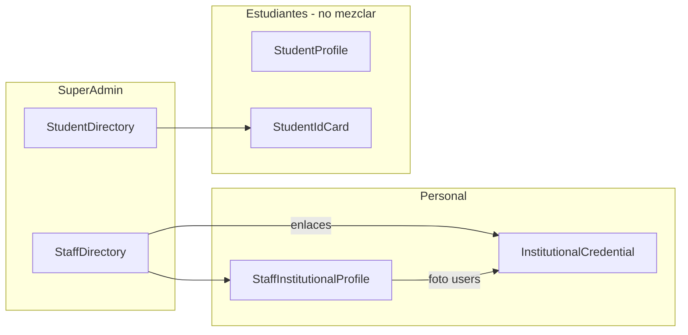

# Análisis: Réplica de StudentDirectory → StaffDirectory (personal institucional)

**Proyecto:** SchoolManager · ASP.NET Core MVC + Razor + PostgreSQL  
**Fecha:** 24 de mayo de 2026  
**Fase:** Solo análisis — **sin implementación**, sin commits, sin cambios en BD.

**Contexto obligatorio:** [ANALISIS_STAFF_PROFILE_CARNET_INSTITUCIONAL.md](./ANALISIS_STAFF_PROFILE_CARNET_INSTITUCIONAL.md)

**Rutas:**
- Origen UX: `/SuperAdmin/StudentDirectory`
- Destino: `/SuperAdmin/StaffDirectory`

**Restricciones de esta fase (no tocar código):**
- `StudentDirectory` (vista, controlador, servicio)
- `StudentProfile`, `StudentIdCard`, `InstitutionalCredential`
- `StaffDirectory` actual (vista/JS tal como está hoy)
- Base de datos, migraciones, tablas nuevas

---

## 1. Resumen ejecutivo

El ecosistema de carnet institucional ya está **partido en tres capas** (ver análisis de perfil):

| Capa | Módulo | Rol |
|------|--------|-----|
| Autogestión | `StaffInstitutionalProfile` | El usuario staff edita su perfil |
| Gestión masiva SuperAdmin | `StaffDirectory` | Listado, foto, cargo/área/código |
| Emisión credencial | `InstitutionalCredential` | Generar / imprimir carnet + QR |

`StudentDirectory` (~742 líneas, una vista) es el **referente de diseño enterprise**: filtros en card, tabla striped, paginación rica, modal de foto con cámara/galería, cola offline IndexedDB, SchoolUi, actualización de miniatura **sin reload**.

`StaffDirectory` (~235 líneas) **ya cumple el dominio de negocio** (personal, `staff_institutional_profiles`, enlace a credencial) pero con **UX inferior**: `card-secondary`, tabla simple, `alert()`, reload tras AJAX, sin filtro rápido, columnas incompletas en pantalla.

**Recomendación:** en una fase de implementación futura, **replicar look & feel y comportamiento de foto** de StudentDirectory **solo** en `StaffDirectory.cshtml` (+ ajustes menores en `SuperAdminStaffDirectoryRowVm` / `GetStaffDirectoryPageAsync`), **sin editar** StudentDirectory y **sin cambiar** la lógica de `InstitutionalCredential`. Complementar acción “Editar perfil” con modal existente o enlace a `StaffInstitutionalProfile` solo para el propio usuario (no sustituye edición SuperAdmin masiva).

**No se requieren tablas nuevas.** Reutilizar: `users`, `staff_institutional_profiles`, `institutional_credential_cards`, `staff_qr_tokens`.

---

## 2. Estado actual de StudentDirectory

### 2.1 Estructura visual

```
[_SuperAdminLayout]
  Card filtros (card-outline card-primary)
    GET form: Search, SchoolId, GradeId, GroupId, ShiftId, PageSize, UserStatus
    Checkbox OnlyWithoutAssignment
    Botones Aplicar / Limpiar
  Barra herramientas
    Texto "Mostrando X–Y de Z"
    Badge offline + badge red/en línea
    Botón "Sincronizar fotos pendientes"
    Input filtro rápido filas (#tableQuickFilter)
  Card tabla (shadow-sm, table-striped)
    #studentDirectoryTable — 11 columnas
  Card-footer paginación (Anterior / ventana / Siguiente)
  Modal #studentPhotoModal (foto)
  @section Scripts — IIFE ~400 líneas + <style> .student-thumb
```

- **Responsive:** grid Bootstrap `col-lg-4 col-md-6`; `table-responsive`.
- **Sin partial views** — todo inline en `Views/SuperAdmin/StudentDirectory.cshtml`.
- **Sin DataTables** en esta vista (confundir con `StudentIdCard/Index` que sí usa DataTables).

### 2.2 Estructura funcional

| Función | Implementación |
|---------|----------------|
| Listado | `GET StudentDirectory` → `ISuperAdminService.GetStudentDirectoryPageAsync` |
| Filtros servidor | EF sobre `StudentAssignments` activas + usuarios estudiante “huérfanos” |
| Paginación | `Page`, `PageSize` (1–100), `GetDirectoryQueryForPage` |
| Subir foto | `POST StudentDirectoryUpdatePhoto` → `IUserPhotoService` |
| Quitar foto | `POST StudentDirectoryRemovePhoto` |
| Carnet estudiante | **No** en esta pantalla |

### 2.3 Archivos

| Tipo | Ruta |
|------|------|
| Controlador | `Controllers/SuperAdminController.cs` |
| Vista | `Views/SuperAdmin/StudentDirectory.cshtml` |
| VM | `ViewModels/SuperAdminStudentDirectoryViewModels.cs` |
| Servicio | `Services/Implementations/SuperAdminService.cs` (`GetStudentDirectoryPageAsync`, builders) |
| Foto CDN | `Helpers/UserPhotoLinks.cs`, `Controllers/FileController.cs` |
| Layout menú | `Views/Shared/_SuperAdminLayout.cshtml` |

### 2.4 Endpoints

| Método | Ruta | Respuesta |
|--------|------|-----------|
| GET | `/SuperAdmin/StudentDirectory` | HTML |
| POST | `/SuperAdmin/StudentDirectoryUpdatePhoto` | JSON `{ success, photoUrl?, message? }` |
| POST | `/SuperAdmin/StudentDirectoryRemovePhoto` | JSON `{ success, message? }` |

- `[Authorize(Roles = "superadmin")]` en `SuperAdminController`.
- `[ValidateAntiForgeryToken]`, `[RequestSizeLimit(12 MB)]` en upload.

### 2.5 Componentes reutilizables (para Staff)

| Componente | ¿Reutilizable? |
|------------|----------------|
| Patrón card filtros + card tabla + footer paginación | Sí — adaptar campos |
| `.student-thumb` / placeholder circular | Sí — renombrar a `staff-thumb` |
| `UserPhotoLinks.HrefListThumbnail` | Sí — idéntico |
| Modal foto + fetch FormData | Sí — cambiar URLs POST |
| IndexedDB offline | Opcional — DB `staff_photo_offline_db` |
| `window.SchoolUi` / SweetAlert | Sí — layout SuperAdmin ya carga sweetalert2 |
| `data-search` + filtro rápido | Sí |
| `GetStudentDirectoryPageAsync` | **No** |
| Filtros grado/grupo/jornada | **No** |

### 2.6 Comportamiento JavaScript (resumen)

- Vanilla JS + Bootstrap 5 Modal (no jQuery obligatorio en esta vista).
- `buildUserPhotoHref` / `buildUserPhotoThumbHref` → `/File/GetUserPhoto?photoUrl=...&variant=thumb`.
- Upload: headers `RequestVerificationToken`, `X-Requested-With`.
- `applyThumbToTable` / `applyPendingToRow` — DOM update sin reload.
- Offline: `openDb`, `queuePhotoOffline`, `syncQueuedPhotos`, listeners `online`/`offline`.
- Eliminar foto: confirmación `SchoolUi.confirmDanger` o `confirm`.

### 2.7 Documentación checklist Fase 1

| Ítem | Estado |
|------|--------|
| Estructura visual | Documentada arriba |
| Estructura funcional | GET + 2 POST foto |
| Endpoints | 3 rutas |
| Componentes reutilizables | Tabla §2.5 |
| Comportamiento JS | §2.6 |
| DataTables | **No usado** |
| SweetAlert / SchoolUi | Sí |
| Carnet en vista | No |

---

## 3. Estado actual de StaffDirectory

### 3.1 Qué existe (funcional)

| Área | Detalle |
|------|---------|
| GET listado | `StaffDirectory` + `GetStaffDirectoryPageAsync` |
| Filtros | Search, SchoolId, Role (BD), UserStatus, PageSize |
| Paginación servidor | Page, DisplayFrom/To, enlaces por número de página |
| Tabla | Foto (si hay URL), nombre+email, rol, cargo, área, escuela |
| POST foto | `StaffDirectoryUpdatePhoto`, `StaffDirectoryRemovePhoto` + `IsInstitutionalStaffRole` |
| POST perfil laboral | `StaffDirectorySaveProfile` → upsert `staff_institutional_profiles` |
| Credencial | Link `GET /InstitutionalCredential/ui/generate/{userId}` |
| Modales | `#photoModal`, `#profileModal` |
| JS inline | ~55 líneas, IIFE, fetch POST, `location.reload()` |

### 3.2 Qué falta vs StudentDirectory (UX / completitud)

| Gap | Impacto |
|-----|---------|
| Mismo look & feel (primary card, striped table, barra superior) | Percepción “producto distinto” |
| Columnas: documento, correo dedicado, estado, código en tabla | Datos ocultos o solo en email subtext |
| Miniatura siempre (placeholder si no hay foto) | Lista menos escaneable |
| Filtro rápido cliente | Menos usabilidad con página llena |
| Modal foto avanzado (cámara, auto-upload, SchoolUi) | Flujo más lento |
| Sin reload tras foto | Peor UX en campo |
| Paginación Anterior/Siguiente + ventana | Navegación más débil |
| Offline fotos | Solo online |
| Botón imprimir credencial | Solo generate |
| Badge “credencial activa” | No visible en fila |
| Allowlist roles (excluir parent/acudiente) | Riesgo listado incorrecto |

### 3.3 Qué está incompleto (datos vs UI)

El **ViewModel** `SuperAdminStaffDirectoryRowVm` ya trae: `DocumentId`, `EmployeeCode`, `Status`, `Email` — la **vista no los muestra todos** en columnas.

### 3.4 Qué ya puede reutilizarse sin cambiar StudentDirectory

| Recurso | Uso |
|---------|-----|
| `StaffDirectoryUpdatePhoto` / `RemovePhoto` / `SaveProfile` | Mantener contratos POST |
| `GetStaffDirectoryPageAsync` | Extender proyección (credencial, allowlist) |
| `StaffInstitutionalRoleFilter` | Filtro base; evaluar allowlist solo en directorio |
| `IUserPhotoService` | Idéntico a estudiantes |
| `UserPhotoLinks` / `FileController` | Idéntico |
| `InstitutionalCredential` | Solo enlaces HTTP |
| Módulo `StaffInstitutionalProfile` | Autogestión usuario; **no** reemplaza directorio SuperAdmin |

### 3.5 Relación con análisis de perfil institucional

Según [ANALISIS_STAFF_PROFILE_CARNET_INSTITUCIONAL.md](./ANALISIS_STAFF_PROFILE_CARNET_INSTITUCIONAL.md):

- **StaffDirectory** = operación centralizada SuperAdmin (ya existe).
- **StaffInstitutionalProfile** = perfil propio del staff (implementado aparte).
- **InstitutionalCredential** = emisión; no duplicar en directorio.

La réplica visual de StudentDirectory **no sustituye** StaffInstitutionalProfile; la acción “Editar perfil” en directorio puede ser:
- **A)** Modal cargo/área/código (actual), o
- **B)** Enlace a `SuperAdmin/EditUser/{id}` si se desea edición completa de usuario (fuera de alcance mínimo).

### 3.6 Archivos StaffDirectory actuales

| Capa | Ruta |
|------|------|
| Vista | `Views/SuperAdmin/StaffDirectory.cshtml` |
| VM | `ViewModels/SuperAdminStaffDirectoryViewModels.cs` |
| Servicio | `SuperAdminService.GetStaffDirectoryPageAsync` |
| Controlador | `SuperAdminController` (acciones Staff*) |

---

## 4. Comparativa funcional (StudentDirectory vs StaffDirectory)

| Funcionalidad | StudentDirectory | StaffDirectory | Se debe copiar UX | Adaptación | Riesgo |
|---------------|------------------|----------------|-------------------|------------|--------|
| Tabla HTML principal | Sí | Sí | Sí (diseño) | Columnas staff | Bajo |
| Card filtros | primary | secondary | Sí | Mantener filtro **Rol** staff | Bajo |
| Paginación servidor | Avanzada | Básica | Sí | Misma UX | Bajo |
| Filtro búsqueda servidor | Sí | Sí | Ya existe | — | — |
| Filtro escuela | Sí | Sí | Ya existe | — | — |
| Filtro grado/grupo/jornada | Sí | No | **No copiar** | — | — |
| Filtro rol | No | Sí | **Mantener** | — | — |
| Solo sin matrícula | Sí | No | **No copiar** | — | — |
| Filtro rápido cliente | Sí | No | Sí | `data-search` staff | Bajo |
| DataTables plugin | No | No | **No** | — | — |
| Foto miniatura | Siempre + thumb | Solo si URL | Sí | `HrefListThumbnail` | Bajo |
| Modal foto | Avanzado | Básico | Sí | Metadata rol/cargo/escuela | Medio |
| Subir foto AJAX | Sí | Sí | Sí | Endpoints Staff | Bajo |
| Eliminar foto | SchoolUi | alert | Sí | StaffDirectoryRemovePhoto | Bajo |
| Sin reload tras foto | Sí | No (reload) | Sí | — | Bajo |
| Offline IndexedDB | Sí | No | Opcional | Nombre DB distinto | Medio |
| SweetAlert / SchoolUi | Sí | No | Sí | — | Bajo |
| Editar perfil laboral | No | Sí (modal) | **Mantener** | Integrar en UX unificada | Bajo |
| Carnet estudiante | No en vista | No | **No** | — | — |
| Ver/generar credencial | No | Sí (generate) | **Mantener** | — | — |
| Imprimir credencial | No | No | Añadir enlace | `/InstitutionalCredential/ui/print/{id}` | Bajo |
| Ordenamiento servidor | Por escuela+nombre | Igual | Ya existe | — | — |
| Ordenamiento cliente | Solo quick filter | No | Opcional | No DataTables | Bajo |
| Exportación | No | No | No | — | — |
| Responsive | Bootstrap grid | Parcial | Igualar grid | col-lg-* | Bajo |

---

## 5. Mapeo visual (Fase 3 — reutilizable / adaptar / no copiar)

| Elemento UI | StudentDirectory | StaffDirectory hoy | Decisión |
|-------------|------------------|-------------------|----------|
| **Foto** (columna) | Thumb circular siempre | Thumb o "—" | **Adaptar** — placeholder + thumb |
| **Nombre** | Columna dedicada | Nombre + email apilado | **Adaptar** — columna nombre; email aparte |
| **Documento** | Columna | No visible | **Adaptar** — mostrar `DocumentId` |
| **Correo** | Columna | Subtexto | **Adaptar** — columna |
| **Escuela** | Columna | Columna | **Reutilizable** |
| **Estado** | Badge | No en tabla | **Adaptar** |
| **Grado** | Columna | — | **No copiar** |
| **Grupo** | Columna | — | **No copiar** |
| **Jornada** | 2 columnas | — | **No copiar** |
| **Rol** | — | Badge | **Mantener** (solo staff) |
| **Cargo** | — | Columna | **Mantener** |
| **Departamento** | — | Columna | **Mantener** |
| **Código institucional** | — | No en tabla | **Adaptar** |
| **Acciones** | Tomar/Subir foto | Foto, Cargo, Credencial | **Adaptar** — más botones, mismo estilo |
| **Carnet** | No | Generate | **Mantener** + print |
| **Filtros** | 6+ campos académicos | 4 campos | **Adaptar** shell, no campos académicos |
| **DataTables** | No | No | **No copiar** |
| **Modales** | 1 foto grande | 2 simples | **Adaptar** — foto estilo Student; perfil laboral |
| **Preview foto** | 170px + placeholder | max 220px | **Reutilizable** patrón |
| **Subida foto** | fetch + opcional offline | fetch + reload | **Adaptar** endpoints Staff |
| **Eliminar foto** | SchoolUi confirm | alert | **Reutilizable** patrón |
| **Paginación** | Footer completo | Lista páginas | **Reutilizable** |
| **Tarjetas** | card-primary | card-secondary | **Adaptar** — primary o tema teal staff |
| **Offline badges** | Sí | No | **Opcional copiar** |

---

## 6. Diseño propuesto para StaffDirectory (Fase 4)

### 6.1 Look & feel

Misma jerarquía que StudentDirectory:

1. Card filtros (`card-outline card-primary` o variante teal alineada a `StaffInstitutionalProfile`).
2. Barra: contador + (opcional) offline + filtro rápido.
3. Card tabla `table-striped` + `table-responsive`.
4. Footer paginación con Anterior/Siguiente.
5. Modales Bootstrap 5.

### 6.2 Columnas

| # | Columna | Fuente datos |
|---|---------|--------------|
| 1 | Foto | `users.photo_url` |
| 2 | Nombre completo | `name` + `last_name` |
| 3 | Documento | `document_id` |
| 4 | Correo | `email` |
| 5 | Rol | `FormatRoleDisplay(role)` |
| 6 | Escuela | `schools.name` |
| 7 | Cargo | `staff_institutional_profiles.job_title` |
| 8 | Departamento | `staff_institutional_profiles.department` |
| 9 | Código institucional | `staff_institutional_profiles.employee_code` |
| 10 | Estado | `users.status` → badge |
| 11 | Acciones | Botones |

### 6.3 Acciones por fila

| Acción | Implementación propuesta | Toca InstitutionalCredential |
|--------|-------------------------|-------------------------------|
| Editar perfil institucional | Modal cargo/dept/código (POST actual) o panel expandido | No |
| Subir foto | Modal estilo Student → `StaffDirectoryUpdatePhoto` | No |
| Eliminar foto | Mismo modal → `StaffDirectoryRemovePhoto` | No |
| Ver credencial | `GET /InstitutionalCredential/ui/generate/{userId}` | Solo enlace |
| Generar credencial | Mismo URL (botón en vista generate) | Solo enlace |
| Imprimir credencial | `GET /InstitutionalCredential/ui/print/{userId}` | Solo enlace |

**No incluir:** grado, grupo, acudiente, `StudentPaymentAccess`, pagos, `StudentIdCard`, datos académicos.

### 6.4 Filtros propuestos (servidor)

- Buscar (nombre, apellido, correo, cédula) — **ya existe**
- Escuela — **ya existe**
- Rol — **ya existe** (mejorar display con `FormatRoleDisplay` en combo opcional)
- Estado usuario — **ya existe**
- PageSize 25/50/100 — **ya existe**
- **No:** GradeId, GroupId, ShiftId, OnlyWithoutAssignment

### 6.5 Listado — criterio de inclusión (recomendación)

Hoy: `StaffInstitutionalRoleFilter.WhereIsInstitutionalStaff` = todos los roles ≠ estudiante.

**Propuesta futura** (solo en `GetStaffDirectoryPageAsync`):

Incluir: `superadmin`, `admin`, `director`, `teacher`, `docente`, `secretaria`, `inspector`, `contable`, `contabilidad`.  
Excluir: `student`, `estudiante`, `parent`, `acudiente`, `clubparentsadmin`.

Alineado con [ANALISIS_STAFF_PROFILE_CARNET_INSTITUCIONAL.md](./ANALISIS_STAFF_PROFILE_CARNET_INSTITUCIONAL.md) y módulo `StaffInstitutionalProfileAccess`.

---

## 7. Mapeo de datos (Fase 5)

| Campo UI | Origen SQL / EF |
|----------|-----------------|
| Nombre completo | `users.name` + `users.last_name` |
| Documento | `users.document_id` |
| Correo | `users.email` |
| Rol (display) | `users.role` → `StaffInstitutionalRoleFilter.FormatRoleDisplay` |
| Escuela | `users.school_id` → `schools.name` |
| Foto | `users.photo_url` → `UserPhotoLinks.HrefListThumbnail` → `File/GetUserPhoto` |
| Cargo | `staff_institutional_profiles.job_title` |
| Departamento | `staff_institutional_profiles.department` |
| Código institucional | `staff_institutional_profiles.employee_code` |
| Estado | `users.status` |
| Credencial activa (opcional) | `institutional_credential_cards` WHERE `user_id` AND `status = 'active'` |
| QR (no en tabla) | `staff_qr_tokens` vía flujo generate |

---

## 8. Riesgos

| ID | Riesgo | Severidad | Mitigación |
|----|--------|-----------|------------|
| R1 | Editar `StudentDirectory` por error | Alta | Rama Git dedicada; solo `StaffDirectory.cshtml` |
| R2 | Listar padres/acudientes como personal | Media | Allowlist en servicio directorio |
| R3 | Duplicar 700+ líneas JS | Media | Script compartido configurable en fase 2 |
| R4 | Romper POST Staff al renombrar campos | Media | Conservar nombres FormData actuales |
| R5 | Confundir carnet estudiante vs institucional | Alta | Solo URLs `InstitutionalCredential` |
| R6 | Modificar `InstitutionalCredential` innecesariamente | Media | Solo enlaces desde vista |
| R7 | Regresión foto Cloudinary | Baja | Mismos `IUserPhotoService` / `variant=thumb` |
| R8 | Subqueries N+1 credencial por fila | Media | LEFT JOIN o proyección única en EF |

---

## 9. Archivos afectados (implementación futura)

### 9.1 Archivos que probablemente se modificarían

| Archivo | Cambio |
|---------|--------|
| `Views/SuperAdmin/StaffDirectory.cshtml` | Réplica UX (principal) |
| `ViewModels/SuperAdminStaffDirectoryViewModels.cs` | `HasActiveCredential`, etc. |
| `Services/Implementations/SuperAdminService.cs` | `GetStaffDirectoryPageAsync` (allowlist, join credencial) |
| `Helpers/StaffInstitutionalProfileAccess.cs` o nuevo helper | Allowlist directorio (opcional) |
| `wwwroot/js/superadmin-directory-photo.js` | Opcional DRY |
| `wwwroot/css/superadmin-directory.css` | Opcional thumbs compartidos |

### 9.2 Archivos prohibidos (no tocar)

| Archivo / módulo |
|------------------|
| `Views/SuperAdmin/StudentDirectory.cshtml` |
| `SuperAdminStudentDirectoryViewModels.cs` |
| Acciones `StudentDirectory*` en controlador |
| `GetStudentDirectoryPageAsync` y builders de estudiante |
| `StudentProfile*`, `StudentIdCard*` |
| `InstitutionalCredentialController` y servicios de credencial |
| `ClubParents*`, `StudentPaymentAccess` |
| Esquema BD / migraciones |
| **En esta fase de análisis:** `StaffDirectory.cshtml` actual (congelado hasta implementación) |

### 9.3 Servicios y endpoints reutilizables

**Servicios (sin cambio de contrato):**

- `IUserPhotoService`
- `ISuperAdminService.GetStaffDirectoryPageAsync` (ampliar solo)
- `IInstitutionalCredentialService` — no invocar desde directorio

**Endpoints (mantener):**

| Endpoint |
|----------|
| `GET /SuperAdmin/StaffDirectory` |
| `POST /SuperAdmin/StaffDirectoryUpdatePhoto` |
| `POST /SuperAdmin/StaffDirectoryRemovePhoto` |
| `POST /SuperAdmin/StaffDirectorySaveProfile` |
| `GET /InstitutionalCredential/ui/generate/{userId}` |
| `GET /InstitutionalCredential/ui/print/{userId}` |

---

## 10. Plan de implementación (futuro)

| Fase | Entregable |
|------|------------|
| **1** | Shell visual: cards, tabla striped, columnas completas, paginación avanzada |
| **2** | Filtros staff + filtro rápido + (opcional) allowlist roles |
| **3** | Modal foto paridad Student + sin reload + SchoolUi |
| **4** | Acciones credencial (generate + print) + modal perfil laboral unificado |
| **5** | (Opcional) Offline IndexedDB + script JS compartido |
| **6** | Pruebas regresión (§11) |

---

## 11. Plan de pruebas (futuro)

| # | Caso | Esperado |
|---|------|----------|
| 1 | SuperAdmin → `/SuperAdmin/StaffDirectory` | 200, layout SuperAdmin |
| 2 | Look & feel alineado a StudentDirectory | Misma estructura visual |
| 3 | Solo personal institucional | Sin estudiantes; sin parent/acudiente si allowlist |
| 4 | Filtros escuela/rol/búsqueda/estado | Resultados correctos |
| 5 | Miniatura + placeholder | `variant=thumb` |
| 6 | Subir / eliminar foto | JSON success; thumb actualizado sin reload |
| 7 | Guardar cargo, departamento, código | `StaffDirectorySaveProfile` OK |
| 8 | Ver / generar credencial | `InstitutionalCredential` abre |
| 9 | Imprimir credencial | PDF o flujo print |
| 10 | `StudentDirectory` sin cambios | Smoke foto + filtros |
| 11 | `StudentIdCard`, `StudentProfile`, `InstitutionalCredential` lógica | Sin regresión |
| 12 | `StaffInstitutionalProfile` | Sigue operando independiente |

---

## 12. Recomendación final

1. **StudentDirectory es plantilla de UX**, no de dominio — copiar contenedor y foto, no matrícula ni carnet estudiante.
2. **StaffDirectory ya tiene el backend correcto** — la brecha es casi toda **presentación e interacción**.
3. **No fusionar** con `StaffInstitutionalProfile`: directorio SuperAdmin vs autogestión usuario.
4. **InstitutionalCredential** permanece módulo aparte; StaffDirectory solo enlaza.
5. **Implementación mínima de alto valor:** columnas completas + modal foto + paginación + sin reload + SchoolUi.
6. **Sin migraciones** ni tablas nuevas en esta iniciativa.

---

## Apéndice — Diagrama de módulos (contexto carnet institucional)



---

*Documento generado en fase de análisis únicamente. No modifica código funcional ni `StaffDirectory` actual.*
