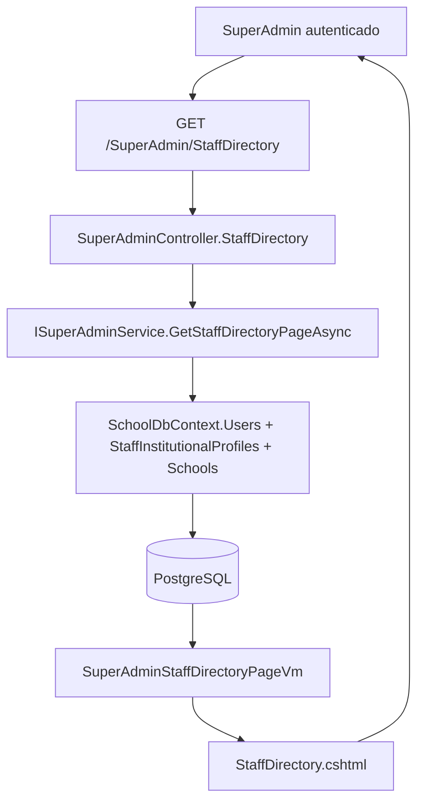
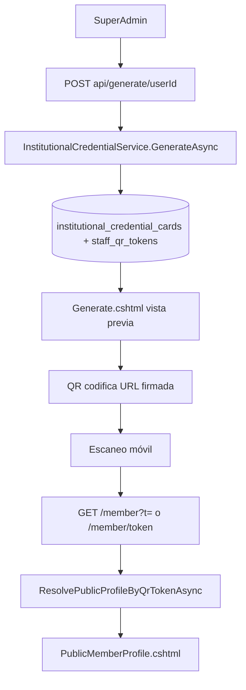

# Auditoría técnica completa — StaffDirectory e InstitutionalCredential

**Proyecto:** `C:\Proyectos\EduplanerIIC\SchoolManager`  
**Base de datos:** PostgreSQL (Render producción)  
**Fecha de auditoría:** 2026-05-24  
**Alcance:** Solo análisis. Sin cambios de código, vistas, modelos ni datos.

---

## Resumen ejecutivo

Existen **dos módulos SuperAdmin** relacionados pero **independientes en código**:

| Módulo | Ruta principal | Propósito |
|--------|----------------|-----------|
| **Directorio de personal** | `/SuperAdmin/StaffDirectory` | Listar personal, filtrar, editar foto y datos laborales (cargo, departamento, código). Enlaces a credencial. |
| **Credencial institucional** | `/InstitutionalCredential/ui` | Listar personal con estado de credencial, generar/regenerar carnet, QR, PDF e impresión. |

**No hay un `StaffDirectoryController` dedicado.** Todo el directorio vive en `SuperAdminController`. La credencial usa `InstitutionalCredentialController` con prefijo de ruta `[Route("InstitutionalCredential")]`.

**Relación entre módulos:** StaffDirectory **no invoca** servicios de credencial. Ambos leen **directamente** `SchoolDbContext` / servicios compartidos (`IUserPhotoService`, helpers de roles). StaffDirectory **prepara datos** (`staff_institutional_profiles`, `users.photo_url`) que la credencial **consume** al generar el carnet.

**Reutilización con carnets de estudiante:** Alta. Comparten `school_id_card_settings`, dimensiones físicas (`IdCardPhysicalDimensions`), `QrHelper`, `IQrSignatureService`, patrón Puppeteer+QuestPDF (`StudentIdCardPdfPrintOptions`), y almacenamiento de fotos (`IFileStorageService` / `File/GetUserPhoto`).

---

## 1. Controladores

### 1.1 `SuperAdminController`

**Archivo:** `Controllers/SuperAdminController.cs`  
**Autorización global:** `[Authorize(Roles = "superadmin")]` (solo minúsculas en el atributo de clase).

#### Árbol — acciones StaffDirectory

```
SuperAdminController  [Authorize(Roles = "superadmin")]
 ├── StaffDirectory()                          GET   /SuperAdmin/StaffDirectory
 ├── StaffDirectoryUpdatePhoto(userId, photo)  POST  /SuperAdmin/StaffDirectoryUpdatePhoto   → JSON
 ├── StaffDirectoryRemovePhoto(userId)         POST  /SuperAdmin/StaffDirectoryRemovePhoto  → JSON
 └── StaffDirectorySaveProfile(...)            POST  /SuperAdmin/StaffDirectorySaveProfile    → JSON
```

| Acción | Método | Tipo | Filtros / validación |
|--------|--------|------|----------------------|
| `StaffDirectory` | GET | Vista HTML | Query: `SuperAdminStaffDirectoryFilterVm` (Search, SchoolId, Role, UserStatus, Page, PageSize) |
| `StaffDirectoryUpdatePhoto` | POST | JSON | `[ValidateAntiForgeryToken]`, `[RequestSizeLimit(12MB)]`, rol elegible vía `StaffInstitutionalProfileAccess.IsStaffDirectoryEligibleRole` |
| `StaffDirectoryRemovePhoto` | POST | JSON | Anti-forgery, rol elegible |
| `StaffDirectorySaveProfile` | POST | JSON | Anti-forgery, rol elegible; escribe `StaffInstitutionalProfile` |

**Policies / claims:** No usa `[Authorize(Policy = "...")]`. Solo rol `superadmin` a nivel de controlador. Los POST no validan `ClaimTypes.NameIdentifier` explícitamente (confían en el rol SuperAdmin).

**Dependencias inyectadas (StaffDirectory):** `ISuperAdminService`, `IUserPhotoService`, `SchoolDbContext`, `ILogger`.

---

### 1.2 `InstitutionalCredentialController`

**Archivo:** `Controllers/InstitutionalCredentialController.cs`  
**Ruta base:** `[Route("InstitutionalCredential")]`  
**Autorización global:** `[Authorize(Roles = "SuperAdmin,superadmin")]`

#### Árbol completo

```
InstitutionalCredentialController  [Authorize(Roles = "SuperAdmin,superadmin")]
 ├── PublicMemberProfile(t)              GET  /InstitutionalCredential/member?t=...     [AllowAnonymous] [RateLimit ScanApiPolicy]
 ├── PublicMemberProfileByPath(token)    GET  /InstitutionalCredential/member/{token} [AllowAnonymous] [RateLimit ScanApiPolicy]
 ├── Index()                             GET  /InstitutionalCredential/ui
 ├── GenerateView(userId)                GET  /InstitutionalCredential/ui/generate/{userId}
 ├── Print(userId)                       GET  /InstitutionalCredential/ui/print/{userId}  → PDF
 ├── GenerateApi(userId)                 POST /InstitutionalCredential/api/generate/{userId} → JSON
 ├── ListJson(...)                       GET  /InstitutionalCredential/api/list-json      → JSON
 ├── ListFilters()                       GET  /InstitutionalCredential/api/list-filters    → JSON
 └── QrPreview(userId)                   GET  /InstitutionalCredential/api/qr-preview/{userId} → JSON
```

| Acción | Auth | Notas |
|--------|------|-------|
| `PublicMemberProfile` | Anónimo | Token firmado HMAC en query `?t=` |
| `PublicMemberProfileByPath` | Anónimo | Token crudo en path (validación en BD) |
| `Index`, `GenerateView`, APIs admin | SuperAdmin | UI y APIs internas |
| `Print` | SuperAdmin | Marca credencial como impresa (`IsPrinted`, `PrintedAt`) |
| `GenerateApi` | SuperAdmin | **Sin** `[ValidateAntiForgeryToken]` (solo cookie de sesión) |

**Métodos privados:** `ApplyInstitutionalCredentialListFilters`, `ResolveCredentialDisplayStatus`, `MarkCardPrintedAsync`, `RenderPublicMemberProfileAsync`, `InvalidPublicMemberProfile`.

---

### 1.3 Controlador relacionado (no solicitado pero acoplado)

**`StaffInstitutionalProfileController`** (`/StaffInstitutionalProfile`) — Autogestión del propio perfil por docentes/admin (no SuperAdmin). Comparte tablas y `IStaffInstitutionalProfileService`. No es la UI de `/SuperAdmin/StaffDirectory`, pero alimenta los mismos campos de BD.

---

## 2. Servicios

### 2.1 StaffDirectory

| Interfaz | Implementación | Método usado | Responsabilidad |
|----------|----------------|--------------|-----------------|
| `ISuperAdminService` | `SuperAdminService` | `GetStaffDirectoryPageAsync` | Paginación, filtros, proyección a `SuperAdminStaffDirectoryRowVm` |
| `IUserPhotoService` | `UserPhotoService` | `UpdatePhotoAsync`, `RemovePhotoAsync` | Sube/elimina foto → `users.photo_url` vía `IFileStorageService` |
| — | `SchoolDbContext` | Directo en controller | `StaffDirectorySaveProfile` → `staff_institutional_profiles` |

**Flujo `GetStaffDirectoryPageAsync`:**

1. Filtra `users` donde `role ∈ StaffDirectoryAllowlist`.
2. Aplica filtros opcionales (escuela, rol, estado, búsqueda ILIKE).
3. Carga opciones de escuelas y roles para `<select>`.
4. Proyecta filas con subconsultas a `staff_institutional_profiles` (job_title, department, employee_code).
5. Ordena por escuela + nombre; pagina.

**Helpers (no DI):** `StaffInstitutionalProfileAccess`, `StaffInstitutionalRoleFilter.FormatRoleDisplay`.

---

### 2.2 InstitutionalCredential

| Interfaz | Implementación | Métodos |
|----------|----------------|---------|
| `IInstitutionalCredentialService` | `InstitutionalCredentialService` | `GetCurrentCardAsync`, `GenerateAsync`, `ResolvePublicProfileByQrTokenAsync` |
| `IInstitutionalCredentialPdfService` | `InstitutionalCredentialPdfService` | `GenerateCardPdfAsync` (QuestPDF nativo) |
| `IInstitutionalCredentialHtmlCaptureService` | `InstitutionalCredentialHtmlCaptureService` | `GenerateFromUrl` (Puppeteer → captura `#idCardFront` → PDF) |
| `IInstitutionalCredentialImageService` | `InstitutionalCredentialImageService` | `GenerateFrontPng`, `GenerateBackPng`, dimensiones mm |
| `IQrSignatureService` | `QrSignatureService` | Firma/validación HMAC de tokens QR |
| — | `SchoolDbContext` | Listados, filtros, `MarkCardPrintedAsync` |

**Registro DI (`Program.cs`):**

```csharp
builder.Services.Configure<InstitutionalCredentialOptions>(...);
builder.Services.AddScoped<IInstitutionalCredentialService, InstitutionalCredentialService>();
builder.Services.AddScoped<IInstitutionalCredentialPdfService, InstitutionalCredentialPdfService>();
builder.Services.AddScoped<IInstitutionalCredentialHtmlCaptureService, InstitutionalCredentialHtmlCaptureService>();
builder.Services.AddScoped<IInstitutionalCredentialImageService, InstitutionalCredentialImageService>();
```

**Opciones:** `InstitutionalCredentialOptions.PublicBaseUrl` — URL base para QR en producción (env: `InstitutionalCredential__PublicBaseUrl`).

---

### 2.3 Flujo `GenerateAsync` (emisión de credencial)

1. Transacción `Serializable`.
2. Valida usuario con `StaffInstitutionalRoleFilter.WhereIsInstitutionalStaff`.
3. Revoca tarjetas activas (`institutional_credential_cards.status = 'revoked'`).
4. Revoca tokens QR (`staff_qr_tokens.is_revoked = true`).
5. Crea nueva tarjeta: `CardNumber = IC-{yyyyMMdd}-{8 chars userId}-{6 random}`, `ExpiresAt = +1 año`, `status = active`.
6. Crea token QR: GUID sin guiones, `ExpiresAt = +6 meses` (`QrTokenValidityMonths = 6`).
7. Construye QR PNG → data URL con URL pública firmada o token crudo.
8. Devuelve `InstitutionalCredentialCardDto`.

---

### 2.4 Flujo impresión PDF (`Print`)

```
Print(userId)
  ├─► HtmlCapture.GenerateFromUrl(/InstitutionalCredential/ui/generate/{userId})
  │     └─ Puppeteer + cookies de sesión + screenshot #idCardFront → QuestPDF
  ├─► (fallback) PdfService.GenerateCardPdfAsync → Skia/QuestPDF nativo
  └─► MarkCardPrintedAsync → UPDATE institutional_credential_cards (is_printed, printed_at)
```

**Nota:** El fallback nativo (`BuildStaffCardDtoAsync`) puede **crear** tarjeta y token en BD si no existen al generar PDF (efecto secundario en ruta de lectura).

---

## 3. Vistas

### 3.1 StaffDirectory

| Archivo | Tipo | Layout |
|---------|------|--------|
| `Views/SuperAdmin/StaffDirectory.cshtml` | Vista principal | `_SuperAdminLayout` |

**Partial views / components:** Ninguno. Modales inline (`#staffPhotoModal`, `#staffProfileModal`).

**CSS:** `wwwroot/css/superadmin-staff-pages.css`  
**JavaScript:** Inline en `@section Scripts` (~420 líneas). Sin archivo `.js` externo.

**Funcionalidad JS:**

- Filtro rápido client-side en página actual.
- Modales foto/perfil con `fetch` POST a acciones SuperAdmin.
- Cola offline IndexedDB (`staff_photo_offline_db`) para fotos sin conexión.
- Enlaces directos a `/InstitutionalCredential/ui/generate/{userId}` y `/ui/print/{userId}`.

---

### 3.2 InstitutionalCredential

| Archivo | Propósito | Layout |
|---------|-----------|--------|
| `Views/InstitutionalCredential/Index.cshtml` | Listado DataTables + filtros | `_SuperAdminLayout` |
| `Views/InstitutionalCredential/Generate.cshtml` | Vista previa carnet + generar/regenerar/PDF | `_SuperAdminLayout` |
| `Views/InstitutionalCredential/PublicMemberProfile.cshtml` | Perfil público QR | `Layout = null` |
| `Views/InstitutionalCredential/PublicMemberInvalid.cshtml` | QR inválido | `Layout = null` |

**CSS:** `superadmin-staff-pages.css` + estilos inline en Index/Generate + CDN DataTables 1.13.6  
**JavaScript:** Inline jQuery + DataTables en Index; inline fetch en Generate.

**Elemento clave impresión HTML:** `#idCardFront` en `Generate.cshtml` (capturado por Puppeteer).

---

### 3.3 Navegación compartida

`Views/Shared/_SuperAdminLayout.cshtml` enlaza:

- `/SuperAdmin/StaffDirectory`
- `/InstitutionalCredential/ui`

---

## 4. ViewModels, DTOs y modelos

### 4.1 StaffDirectory

| Tipo | Archivo | Propiedades principales |
|------|---------|-------------------------|
| `SuperAdminStaffDirectoryFilterVm` | `ViewModels/SuperAdminStaffDirectoryViewModels.cs` | Search, SchoolId, Role, UserStatus, Page, PageSize |
| `SuperAdminStaffDirectoryRowVm` | idem | UserId, PhotoUrl, FullName, DocumentId, Email, SchoolName, RoleRaw/Display, JobTitle, Department, EmployeeCode, Status |
| `SuperAdminStaffDirectoryPageVm` | idem | Filter, Rows, SchoolOptions, RoleOptions, TotalCount, TotalPages, helpers paginación |

---

### 4.2 InstitutionalCredential

| Tipo | Archivo | Uso |
|------|---------|-----|
| `InstitutionalCredentialGenerateViewModel` | `ViewModels/InstitutionalCredentialGenerateViewModel.cs` | Generate.cshtml: colores, flags de plantilla, Card, DocumentId |
| `InstitutionalCredentialCardDto` | `Dtos/InstitutionalCredentialCardDto.cs` | API generate, vista previa, QR preview |
| `StaffCardRenderDto` | `Dtos/StaffCardRenderDto.cs` | Render PDF/imagen nativa |
| `StaffMemberPublicProfileVm` | `ViewModels/StaffMemberPublicProfileVm.cs` | Perfil público QR |
| `StaffMemberPublicInvalidVm` | idem | Error público |

---

### 4.3 Entidades EF (tablas)

| Modelo | Tabla PostgreSQL | PK |
|--------|------------------|-----|
| `User` | `users` | `id` |
| `School` | `schools` | `id` |
| `StaffInstitutionalProfile` | `staff_institutional_profiles` | `user_id` → FK `users.id` CASCADE |
| `InstitutionalCredentialCard` | `institutional_credential_cards` | `id` → FK `users.id` CASCADE |
| `StaffQrToken` | `staff_qr_tokens` | `id` → FK `users.id` CASCADE |
| `SchoolIdCardSetting` | `school_id_card_settings` | por `school_id` (plantilla visual) |

---

## 5. Flujo de datos

### 5.1 StaffDirectory — listado



### 5.2 StaffDirectory — guardar perfil laboral

```
Modal perfil → POST StaffDirectorySaveProfile
  → SuperAdminController valida rol elegible
  → INSERT/UPDATE staff_institutional_profiles (job_title, department, employee_code)
  → JSON { success: true }
```

### 5.3 InstitutionalCredential — listado AJAX

```
Index.cshtml → DataTables GET /InstitutionalCredential/api/list-json
  → InstitutionalCredentialController.ListJson
  → Users + StaffInstitutionalProfiles + InstitutionalCredentialCards (subconsultas)
  → JSON { data: [...] }
```

### 5.4 Generación y consulta pública QR



---

## 6. Base de datos

### 6.1 Consultas SELECT ejecutadas (solo lectura)

Tablas confirmadas en producción:

- `users`, `schools`, `staff_institutional_profiles`, `institutional_credential_cards`, `staff_qr_tokens`, `school_id_card_settings`

**Conteos agregados (producción, 2026-05-24):**

| Tabla | Filas |
|-------|-------|
| `staff_institutional_profiles` | 66 |
| `institutional_credential_cards` | 50 |
| `staff_qr_tokens` | 50 |
| `school_id_card_settings` | 1 |

**Estado credenciales:** 50 activas; 47 marcadas impresas, 3 sin imprimir.

**Elegibilidad por módulo (aprox.):**

| Criterio | Usuarios |
|----------|----------|
| StaffDirectory allowlist + roles definidos | 161 |
| InstitutionalCredential (no estudiante + school_id) | 164 |

Diferencia (~3): roles como `clubparentsadmin` entran en credencial pero **no** en directorio allowlist.

**FK:**

```
institutional_credential_cards.user_id → users.id (CASCADE)
staff_institutional_profiles.user_id   → users.id (CASCADE)
staff_qr_tokens.user_id                → users.id (CASCADE)
```

**Índices relevantes:** `IX_institutional_credential_cards_card_number` (UNIQUE), `IX_staff_qr_tokens_token` (UNIQUE), `IX_institutional_credential_cards_user_id_status`.

---

### 6.2 Mapeo campo a tabla

| Campo en UI | Origen en código | Tabla / columna |
|-------------|------------------|-----------------|
| **Nombre completo** | `u.Name + " " + u.LastName` | `users.name`, `users.last_name` |
| **Cédula / documento** | `u.DocumentId` | `users.document_id` |
| **Correo** | `u.Email` | `users.email` |
| **Rol (raw)** | `u.Role` | `users.role` |
| **Rol (display)** | `StaffInstitutionalRoleFilter.FormatRoleDisplay` | Derivado en código |
| **Escuela** | `SchoolNavigation.Name` / join | `schools.name` vía `users.school_id` |
| **Fotografía** | `u.PhotoUrl` | `users.photo_url` → servida por `/File/GetUserPhoto?photoUrl=...` |
| **Cargo** | `StaffInstitutionalProfile.JobTitle` | `staff_institutional_profiles.job_title` |
| **Departamento** | `StaffInstitutionalProfile.Department` | `staff_institutional_profiles.department` |
| **Código institucional** | `StaffInstitutionalProfile.EmployeeCode` | `staff_institutional_profiles.employee_code` |
| **Estado usuario** | `u.Status` | `users.status` (`active` / otros) |
| **Nº credencial** | `InstitutionalCredentialCard.CardNumber` | `institutional_credential_cards.card_number` |
| **Emisión / vencimiento** | `IssuedAt`, `ExpiresAt` | `institutional_credential_cards.issued_at`, `expires_at` |
| **Estado credencial** | `Status` + lógica expiración | `institutional_credential_cards.status` + fechas |
| **Impreso** | `IsPrinted`, `PrintedAt` | `institutional_credential_cards.is_printed`, `printed_at` |
| **QR (token BD)** | `StaffQrToken.Token` | `staff_qr_tokens.token` |
| **Teléfono** | `users.cellphone_primary/secondary` | **No expuesto** en StaffDirectory ni listado credencial UI |
| **Institución (logo/colores)** | `School` + `SchoolIdCardSetting` | `schools.logo_url`, `school_id_card_settings.*` |

**Perfil público QR adicional:** tipo sangre, alergias, contacto emergencia → columnas en `users` (no editables desde StaffDirectory SuperAdmin).

---

## 7. Generación de credencial (`/InstitutionalCredential/ui`)

### 7.1 Cómo se genera

1. SuperAdmin pulsa **Generar** → `POST /InstitutionalCredential/api/generate/{userId}`.
2. `InstitutionalCredentialService.GenerateAsync` revoca anteriores y crea tarjeta + token.
3. Redirección a `/ui/generate/{userId}` con vista previa HTML.

### 7.2 Cómo se imprime

1. **Preferido:** `GET /ui/print/{userId}` → Puppeteer abre `ui/generate/{userId}` con cookies de sesión, captura `#idCardFront`, empaqueta PDF (QuestPDF).
2. **Fallback:** `InstitutionalCredentialPdfService` dibuja carnet con SkiaSharp (misma plantilla vertical que estudiantes).
3. Tras éxito: `MarkCardPrintedAsync` actualiza BD.

### 7.3 Construcción del QR

| Paso | Detalle |
|------|---------|
| Token almacenado | GUID 32 chars en `staff_qr_tokens.token` |
| Contenido codificado | URL `{PublicBaseUrl}/InstitutionalCredential/member?t={HMAC(token)}` |
| Firma | `IQrSignatureService` con clave `QrSecurity:SecretKey` |
| Imagen | `QrHelper.GenerateQrPng` → base64 data URL en UI |
| Rutas públicas | `?t=` (firmado) o `/member/{token}` (crudo, validado en BD) |
| Validez token | 6 meses; revocable; tarjeta 1 año |

Si `PublicBaseUrl` está vacío (appsettings actual), el QR puede codificar **solo el token crudo** en lugar de URL absoluta.

### 7.4 Datos en el carnet (Generate.cshtml)

| Elemento | Fuente |
|----------|--------|
| Logo / nombre escuela | `schools` + `SchoolIdCardSetting` |
| Foto | `users.photo_url` → `UserPhotoLinks.HrefForCarnetPreview` |
| Nombre | `users.name` + `last_name` |
| Cédula (opcional) | `users.document_id` si `ShowDocumentId` |
| Cargo | `staff_institutional_profiles.job_title` |
| QR | Token activo + firma |
| Colores / watermark | `school_id_card_settings` |

**Nota:** El carnet visible en Generate muestra **cargo**, no rol ni departamento en la cara frontal (el DTO incluye `RoleDisplay`/`Department` pero la vista prioriza cargo).

---

## 8. Relación entre módulos

| Pregunta | Respuesta |
|----------|-----------|
| ¿StaffDirectory alimenta InstitutionalCredential? | **Indirectamente vía BD.** Edita `staff_institutional_profiles` y `users.photo_url`. No hay llamada de servicio entre módulos. |
| ¿InstitutionalCredential consulta BD directamente? | **Sí.** Controller y servicios usan `SchoolDbContext`. |
| ¿Servicio compartido? | `IUserPhotoService`, `IFileStorageService`, helpers de rol, `SchoolIdCardSetting`, `QrHelper`, `IQrSignatureService`. |
| ¿Reutiliza StudentIdCard? | **Sí, parcialmente:** plantilla visual (`SchoolIdCardSetting`), dimensiones físicas, Puppeteer+QuestPDF pattern, `StudentIdCardPdfPrintOptions`, almacenamiento fotos. **No** usa `IStudentIdCardService` ni tablas `student_id_cards`. |
| ¿Dependencias ocultas? | PDF nativo puede **insertar** tarjeta/token si faltan; impresión **actualiza** flags de impresión; perfil público expone datos médicos/emergencia de `users`. |

**Flujo operativo típico:**

```
StaffDirectory → editar foto + cargo/depto/código
      ↓
InstitutionalCredential/ui → generar credencial
      ↓
Generate / Print → carnet con datos actualizados
```

---

## 9. Seguridad

### 9.1 Roles con acceso

| Recurso | Rol requerido |
|---------|---------------|
| `/SuperAdmin/StaffDirectory*` | `superadmin` (atributo clase) |
| `/InstitutionalCredential/ui*` y APIs admin | `SuperAdmin` o `superadmin` |
| `/InstitutionalCredential/member*` | **Público** (rate limit 60/min/IP) |
| `/StaffInstitutionalProfile` | Roles institucionales (no SuperAdmin UI credencial) |

**Inconsistencia:** SuperAdminController solo declara `"superadmin"` minúsculas; InstitutionalCredential acepta ambas variantes. Depende de cómo se almacene el rol en `users.role` (producción: `superadmin` minúsculas).

### 9.2 Validaciones

- StaffDirectory POST: anti-forgery + rol elegible del **usuario objetivo** (no del actor).
- GenerateApi: autenticación por cookie; **sin anti-forgery**.
- Print: valida elegibilidad (`WhereIsInstitutionalStaff` + `SchoolId`).
- QR público: token revocado/expirado rechazado; ruta firmada valida HMAC.

### 9.3 Riesgos documentados (sin corrección)

| Riesgo | Severidad | Descripción |
|--------|-----------|-------------|
| **Exposición PII pública** | Alta | Perfil QR muestra email, sangre, alergias, emergencia sin autenticación. |
| **Token en URL path** | Media | `/member/{token}` expone token en logs, historial, referrers. |
| **Divergencia de roles** | Media | Credencial lista usuarios (ej. `clubparentsadmin`) que StaffDirectory no administra con la misma allowlist. |
| **PDF fallback escribe BD** | Media | `BuildStaffCardDtoAsync` crea credencial/token al imprimir si no existen. |
| **PublicBaseUrl vacío** | Media | QR puede no ser URL escaneable estándar en producción si no se configura env. |
| **SuperAdmin amplio** | Baja | Cualquier SuperAdmin puede editar foto/perfil de cualquier personal elegible (by design). |
| **GenerateApi sin CSRF** | Baja-Media | Mitigado si cookies son SameSite; riesgo CSRF clásico si no. |
| **Secreto QR en appsettings** | Media | `QrSecurity:SecretKey` en archivo de configuración (rotación/documentación). |

### 9.4 Endpoints públicos

- `GET /InstitutionalCredential/member?t=...`
- `GET /InstitutionalCredential/member/{token}`
- `GET /File/GetUserPhoto?...` (fotos referenciadas desde perfil público)

---

## 10. Inventario final

### Controladores

- `SuperAdminController` (StaffDirectory + POSTs)
- `InstitutionalCredentialController`
- `FileController` (GetUserPhoto)
- `StaffInstitutionalProfileController` (relacionado, autogestión)

### Servicios e interfaces

- `ISuperAdminService` / `SuperAdminService`
- `IUserPhotoService` / `UserPhotoService`
- `IInstitutionalCredentialService` / `InstitutionalCredentialService`
- `IInstitutionalCredentialPdfService` / `InstitutionalCredentialPdfService`
- `IInstitutionalCredentialHtmlCaptureService` / `InstitutionalCredentialHtmlCaptureService`
- `IInstitutionalCredentialImageService` / `InstitutionalCredentialImageService`
- `IFileStorageService` / implementación (Cloudinary/local)
- `IQrSignatureService` / `QrSignatureService`
- `IStaffInstitutionalProfileService` / `StaffInstitutionalProfileService` (perfil propio)

### ViewModels / DTOs

- `SuperAdminStaffDirectoryFilterVm`, `SuperAdminStaffDirectoryRowVm`, `SuperAdminStaffDirectoryPageVm`
- `InstitutionalCredentialGenerateViewModel`
- `InstitutionalCredentialCardDto`, `StaffCardRenderDto`
- `StaffMemberPublicProfileVm`, `StaffMemberPublicInvalidVm`

### Vistas

- `Views/SuperAdmin/StaffDirectory.cshtml`
- `Views/InstitutionalCredential/Index.cshtml`
- `Views/InstitutionalCredential/Generate.cshtml`
- `Views/InstitutionalCredential/PublicMemberProfile.cshtml`
- `Views/InstitutionalCredential/PublicMemberInvalid.cshtml`
- `Views/Shared/_SuperAdminLayout.cshtml`

### Partials / components

- Ninguno dedicado (modales inline).

### JavaScript

- Inline en `StaffDirectory.cshtml` (fetch, IndexedDB offline)
- Inline en `InstitutionalCredential/Index.cshtml` (jQuery DataTables)
- Inline en `InstitutionalCredential/Generate.cshtml` (generateCard, PDF download)

### CSS

- `wwwroot/css/superadmin-staff-pages.css`
- Estilos inline en Generate, Index, PublicMemberProfile
- CDN: DataTables 1.13.6, Google Fonts Inter

### Helpers / Options

- `StaffInstitutionalProfileAccess`
- `StaffInstitutionalRoleFilter`
- `StaffMemberPublicLink`
- `InstitutionalCardNumberHelper`
- `QrHelper`
- `UserPhotoLinks`
- `InstitutionalCredentialOptions`
- `QrSecurityOptions`
- `StudentIdCardPdfPrintOptions`

### Tablas PostgreSQL

- `users`
- `schools`
- `staff_institutional_profiles`
- `institutional_credential_cards`
- `staff_qr_tokens`
- `school_id_card_settings`

### Endpoints (resumen)

| Método | Ruta |
|--------|------|
| GET | `/SuperAdmin/StaffDirectory` |
| POST | `/SuperAdmin/StaffDirectoryUpdatePhoto` |
| POST | `/SuperAdmin/StaffDirectoryRemovePhoto` |
| POST | `/SuperAdmin/StaffDirectorySaveProfile` |
| GET | `/InstitutionalCredential/ui` |
| GET | `/InstitutionalCredential/ui/generate/{userId}` |
| GET | `/InstitutionalCredential/ui/print/{userId}` |
| POST | `/InstitutionalCredential/api/generate/{userId}` |
| GET | `/InstitutionalCredential/api/list-json` |
| GET | `/InstitutionalCredential/api/list-filters` |
| GET | `/InstitutionalCredential/api/qr-preview/{userId}` |
| GET | `/InstitutionalCredential/member?t=` |
| GET | `/InstitutionalCredential/member/{token}` |
| GET | `/File/GetUserPhoto` |

---

## 11. Riesgos detectados (consolidado)

1. **PII en perfil público QR** — Datos sensibles de salud y contacto visibles sin login.
2. **Allowlist de roles distinta** — 161 vs 164 usuarios elegibles; posible confusión operativa.
3. **PublicBaseUrl no configurado** — QR puede no apuntar a URL de verificación en Render.
4. **Efectos secundarios en PDF nativo** — Creación automática de credencial al imprimir sin paso explícito de generate.
5. **Doble ruta QR pública** — Path con token crudo menos seguro que query firmada.
6. **Credencial vs carnet estudiante** — Misma tabla de settings; cambios de plantilla afectan ambos contextos visuales.

---

## 12. Oportunidades de mejora (solo documentación, sin implementar)

1. **Unificar criterio de elegibilidad** — Misma allowlist en StaffDirectory e InstitutionalCredential (`StaffInstitutionalProfileAccess.StaffDirectoryAllowlist` vs `WhereIsInstitutionalStaff`).
2. **Configurar `InstitutionalCredential:PublicBaseUrl`** en Render para QR con URL absoluta consistente.
3. **Reducir PII en perfil público** — Mostrar solo nombre, rol, cargo, escuela y estado credencial; ocultar email/salud por defecto.
4. **Deprecar `/member/{token}`** — Usar exclusivamente enlace firmado `?t=`.
5. **Anti-forgery en `GenerateApi`** — Alinear con otros POST del sistema.
6. **Extraer JS a archivos estáticos** — Mantenibilidad de StaffDirectory e Index.
7. **Evitar escritura BD en PDF fallback** — Separar generación explícita de renderizado.
8. **Mostrar teléfono en directorio** — Si es requisito operativo, mapear `users.cellphone_primary`.
9. **Alinear `[Authorize]` SuperAdmin** — Misma lista de roles en ambos controladores.
10. **Auditoría de impresión** — Registrar `createdBy` en tarjetas (hoy `GenerateAsync` recibe actor pero tarjeta no persiste quién emitió).

---

## 13. Confirmación de alcance de auditoría

- **Código:** Solo lectura y análisis.
- **Base de datos:** Solo consultas `SELECT` (conteos, FK, elegibilidad agregada).
- **Sin** INSERT, UPDATE, DELETE, ALTER, migraciones ni cambios de archivos de aplicación (excepto este documento de entrega).

---

*Documento generado como entregable de auditoría técnica. No constituye implementación ni autorización de cambios.*
