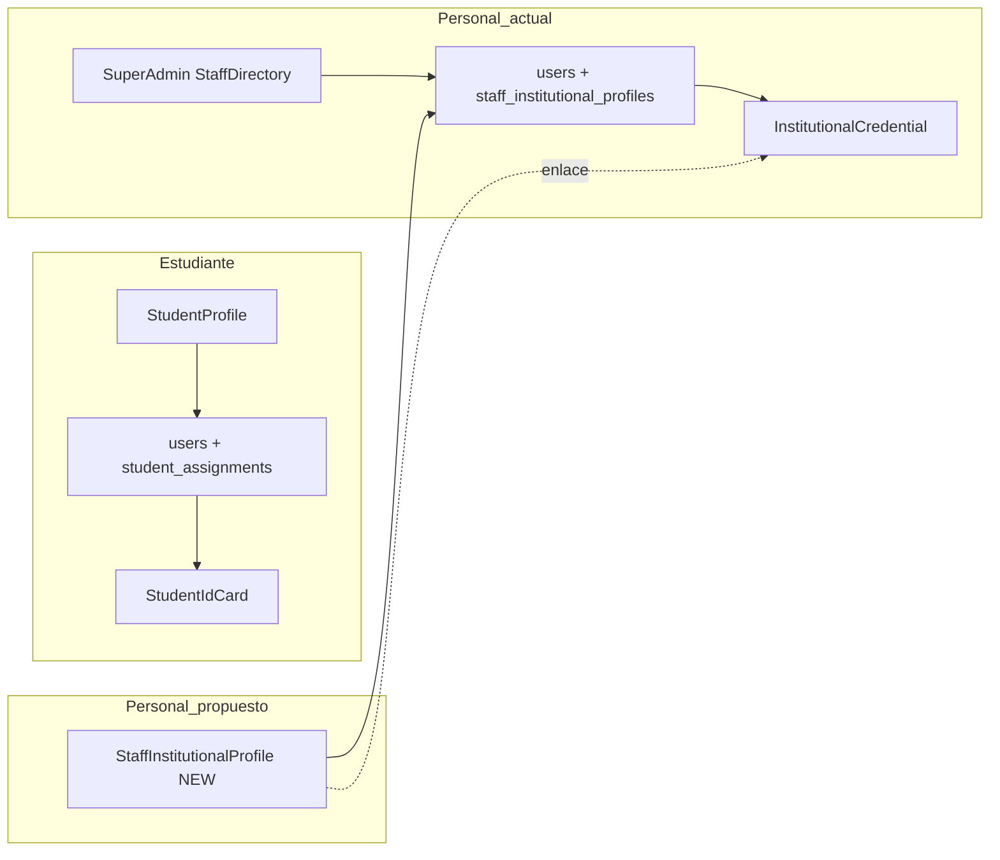

# Análisis: Perfil institucional y carnet de personal

**Proyecto:** SchoolManager (ASP.NET Core MVC + Razor + PostgreSQL)  
**Fecha:** 24 de mayo de 2026  
**Fase:** Solo análisis — sin implementación, sin cambios en BD, sin migraciones, sin modificación de código funcional.

---

## 1. Resumen ejecutivo

El sistema **ya dispone de un módulo de credencial institucional para personal** (`InstitutionalCredential`) y un **directorio de personal en SuperAdmin** (`StaffDirectory`) con foto, cargo/área y enlace a generación de credencial. Lo que **no existe** es un equivalente de **autogestión** tipo `StudentProfile` para que docentes, directores, secretaría, etc. completen o actualicen sus datos (y foto) antes del carnet, ni vistas escolares (admin/director) fuera de SuperAdmin.

**Recomendación principal:** crear un módulo nuevo **`StaffInstitutionalProfile`** (controlador `StaffInstitutionalProfileController`, rutas `/StaffInstitutionalProfile/...`) que **no reutilice** `StudentProfile` ni sus vistas, pero **sí reutilice** `IUserPhotoService`, `UserPhotoLinks`, `StaffInstitutionalRoleFilter`, la entidad `StaffInstitutionalProfile` y el flujo existente de `InstitutionalCredential`.

**Riesgo crítico a evitar:** duplicar lógica de carnet o tocar `StudentIdCard` / `StudentProfile`; el personal ya tiene tablas y servicios propios (`institutional_credential_cards`, `staff_qr_tokens`, `staff_institutional_profiles`).

---

## 2. Estado actual de StudentProfile

### 2.1 Componentes

| Capa | Archivo | Responsabilidad |
|------|---------|-----------------|
| Controlador | `Controllers/StudentProfileController.cs` | `[Authorize(Roles = "student,estudiante")]` |
| Vista | `Views/StudentProfile/Index.cshtml` | Formulario perfil + foto |
| ViewModel | `ViewModels/StudentProfileViewModel.cs` | Datos editables + solo lectura escuela/grado/grupo |
| Servicio | `Services/Implementations/StudentProfileService.cs` | Lectura/escritura `Users` + join `StudentAssignments` |
| Interfaz | `Services/Interfaces/IStudentProfileService.cs` | Contrato del servicio |
| Foto | `IUserPhotoService` vía acciones `UpdatePhoto` / `RemovePhoto` | Cloudinary (vía `IFileStorageService`) |

### 2.2 Entidades y relaciones

- **Tabla principal:** `users` (rol `student` / `estudiante`).
- **Contexto académico:** `student_assignments` → `grade_levels`, `groups`, `schools`.
- **No usa:** `StaffInstitutionalProfile`, `InstitutionalCredentialCard`, `StudentIdCard`.
- **Campos de carnet estudiante en `users`:** `BloodType`, `Allergies`, `EmergencyContact*`, `PhotoUrl` (dominio `UpdatePhoto`).

### 2.3 Campos mostrados vs editables

| Bloque | Solo lectura | Editable por estudiante |
|--------|--------------|-------------------------|
| Escuela / grado / grupo / rol | Sí | No |
| Emergencia (panel izquierdo) | Condicional `ShowEmergencyInfo` (inalcanzable para estudiante con auth actual) | Formulario derecho: sí |
| Foto | Preview | `UpdatePhoto` / `RemovePhoto` |
| Identidad y contacto | — | Nombre, apellido, email, documento, teléfonos, fecha nacimiento, sangre, alergias |

### 2.4 Validaciones y permisos

- DataAnnotations en ViewModel + `ModelState` en POST.
- Unicidad email/documento en servicio y AJAX (`CheckEmailAvailability`, `CheckDocumentAvailability`).
- **Hueco documentado:** AJAX no valida que `userId` sea el de la sesión.
- **Sin** validación `ValidatePlatformAccessAsync` (Club de Padres) en este controlador.

### 2.5 Conexión con carnet estudiante

- La foto y datos de emergencia alimentan **`StudentIdCard`** (misma `users.photo_url`).
- El estudiante **no genera** el carnet desde `StudentProfile`; SuperAdmin/admin lo hacen en `StudentIdCard/ui`.
- Requisito de pago: `StudentPaymentAccess.CarnetStatus == "Pagado"` en `GenerateView` del carnet estudiantil.

---

## 3. Estado actual de StudentIdCard

### 3.1 Rutas y autorización

| Ruta | Acción | Rol |
|------|--------|-----|
| `/StudentIdCard/ui` | Listado | `superadmin` |
| `/StudentIdCard/ui/generate/{studentId}` | Vista previa | `superadmin` |
| `/StudentIdCard/ui/print/{studentId}` | PDF (HTML capture o nativo) | `superadmin` |
| API POST | Generación / estado carnet | `superadmin` |

Controlador: `Controllers/StudentIdCardController.cs` — `[Route("StudentIdCard")]`.

### 3.2 Servicios

| Servicio | Uso |
|----------|-----|
| `IStudentIdCardService` | Carnet activo, generación, revocación |
| `IStudentIdCardPdfService` | PDF nativo (fallback) |
| `IStudentIdCardHtmlCaptureService` | Puppeteer/URL → PDF |
| `IStudentIdCardImageService` | Composición imagen |
| `IQrSignatureService` | QR firmado |

### 3.3 Datos del carnet

- **Usuario:** `User` con filtro `StudentRoleFilter.WhereIsStudent`.
- **Tablas:** `student_id_cards`, `student_qr_tokens`, `scan_logs`.
- **Configuración escuela:** `school_id_card_settings`, `id_card_template_fields`, logo en `schools`.
- **Académico:** `student_assignments` + año lectivo para nombre en plantilla.
- **Foto:** `UserPhotoLinks.HrefForCarnetPreview` → `/File/GetUserPhoto`.
- **QR:** reverso del carnet; validación pública según configuración escuela.

### 3.4 CSS e impresión

- Vista `Views/StudentIdCard/Generate.cshtml`: layout tipo tarjeta CR80, colores desde settings, marca de agua con logo.
- Impresión: captura de la URL de generate o PDF programático.

**Separación clara:** ningún endpoint de `StudentIdCard` usa `StaffInstitutionalRoleFilter`.

---

## 4. Estado actual de credencial institucional (personal)

> **Hallazgo clave:** el carnet de personal **ya está implementado** en paralelo al estudiantil.

### 4.1 Rutas

| Ruta | Descripción | Rol actual |
|------|-------------|------------|
| `/InstitutionalCredential/ui` | Listado personal | `superadmin` |
| `/InstitutionalCredential/ui/generate/{userId}` | Vista / generar | `superadmin` |
| `/InstitutionalCredential/ui/print/{userId}` | PDF | `superadmin` |
| `/InstitutionalCredential/api/generate/{userId}` | POST generar | `superadmin` |
| `/InstitutionalCredential/api/list-json` | DataTable listado | `superadmin` |

Controlador: `Controllers/InstitutionalCredentialController.cs`.

### 4.2 Servicios y tablas

| Componente | Detalle |
|------------|---------|
| `IInstitutionalCredentialService` | `GetCurrentCardAsync`, `GenerateAsync` |
| `InstitutionalCredentialCard` | Número, `IssuedAt`, `ExpiresAt` (~1 año), `Status`, `IsPrinted` |
| `StaffQrToken` | Token QR, revocación, expiración (~6 meses) |
| `StaffInstitutionalProfile` | `JobTitle`, `Department`, `EmployeeCode` (1:1 con `UserId`) |
| Filtro roles | `StaffInstitutionalRoleFilter` — todos los no-alumno |

### 4.3 Contenido visual del carnet

Vista `Views/InstitutionalCredential/Generate.cshtml`:

- Logo y nombre escuela (`SchoolIdCardSetting` compartido con carnet estudiantil para colores/plantilla base).
- Foto (`ShowPhoto`, `UserPhotoLinks`).
- Nombre, cédula (opcional), **rol** (`FormatRoleDisplay`), **cargo**, **área/departamento**.
- Reverso: QR si `ShowQr`.
- **Sin** gate de pago; **sin** `StudentAssignment`.

### 4.4 SuperAdmin/StaffDirectory

| Acción | Qué hace |
|--------|----------|
| `GET SuperAdmin/StaffDirectory` | Tabla paginada: foto, rol, cargo, área, escuela |
| `POST StaffDirectoryUpdatePhoto` | `IUserPhotoService` + validación `IsInstitutionalStaffRole` |
| `POST StaffDirectoryRemovePhoto` | Igual |
| `POST StaffDirectorySaveProfile` | Upsert `StaffInstitutionalProfile` (jobTitle, department, employeeCode) |
| Enlace UI | `/InstitutionalCredential/ui/generate/{userId}` |

### 4.5 SuperAdmin/StudentDirectory (estudiantes)

- `GET SuperAdmin/StudentDirectory` — solo estudiantes (`StudentRoleFilter`).
- Fotos: mismos endpoints propios `StudentDirectoryUpdatePhoto` / `RemovePhoto` → **`IUserPhotoService`** (Cloudinary).
- No edita `StaffInstitutionalProfile`.

### 4.6 Almacenamiento de imágenes

- **Producción:** Cloudinary (`ICloudinaryService`, `IFileStorageService.SaveUserPhotoAsync`).
- **Entrega:** `FileController.GetUserPhoto` con variantes `thumb`, `carnetEdge`.
- **En BD:** `users.photo_url` (string URL/path), no BLOB.
- **Helper:** `Helpers/UserPhotoLinks.cs`.

---

## 5. Estado actual de usuarios y roles

### 5.1 Modelo `User` (tabla `users`)

Campos relevantes para carnet/perfil (todos los roles):

| Campo | Uso carnet personal | Uso carnet estudiante |
|-------|---------------------|------------------------|
| `Name`, `LastName` | Sí | Sí |
| `Email` | Perfil / contacto | Perfil |
| `DocumentId` | Frente credencial | Frente carnet |
| `PhotoUrl` | Frente credencial | Frente carnet |
| `SchoolId` | Requerido para elegibilidad | Requerido |
| `Role` | Texto + filtro staff | Filtro student |
| `Status` | Directorio | Directorio |
| `CellphonePrimary/Secondary` | Perfil (no en credencial hoy) | Perfil estudiante |
| `DateOfBirth` | Perfil | Perfil |
| `BloodType`, `Allergies`, `Emergency*` | No en credencial institucional | Carnet / perfil estudiante |
| `Disciplina`, `Orientacion`, etc. | Flags docente | N/A |

**No hay tabla `roles` separada:** el rol es columna `users.role` con constraint `users_role_check`.

### 5.2 Roles en constraint PostgreSQL (`EnsureUsersRoleCheck`)

`superadmin`, `admin`, `director`, `teacher`, `parent`, `student`, `estudiante`, `acudiente`, `contable`, `contabilidad`, `secretaria`, `clubparentsadmin`, `qlservices`, `inspector`.

**Nota:** `coordinator`, `counselor`, `security`, `staff` aparecen en `FormatRoleDisplay` pero **no** en el CHECK de BD — si existieran en datos, serían inválidos o legacy manual.

### 5.3 Tabla `staff_institutional_profiles`

| Campo | Propósito |
|-------|-----------|
| `UserId` (PK/FK) | 1:1 con usuario staff |
| `JobTitle` | Cargo en credencial |
| `Department` | Área en credencial |
| `EmployeeCode` | Código institucional (no mostrado hoy en Generate.cshtml principal; usado en PDF service) |

### 5.4 Datos que faltan para un perfil “completo” (recomendación futura, sin BD en esta fase)

| Dato | Estado | Notas |
|------|--------|-------|
| Código institucional | Parcial (`EmployeeCode` existe, poco expuesto en UI carnet) | Mostrar en carnet si negocio lo pide |
| Fecha emisión / vencimiento | En `InstitutionalCredentialCard` | Solo tras generar carnet |
| Año lectivo en credencial staff | No | Estudiante sí usa assignment |
| Cargo / área | Sí (`StaffInstitutionalProfile`) | Solo editable en SuperAdmin hoy |
| Autogestión foto/datos | Parcial | Admin `User/Edit` tiene foto; sin perfil staff dedicado |

### 5.5 Otros puntos de edición de usuarios (no perfil dedicado)

| Módulo | Rol | Alcance |
|--------|-----|---------|
| `UserController` | `admin`, `secretaria` | CRUD usuarios escuela, foto, **sin** `StaffInstitutionalProfile` |
| `SuperAdmin/EditUser` | `superadmin` | Edición global |
| `StudentProfile` | `student` | Solo estudiantes |

---

## 6. Riesgos detectados

| ID | Riesgo | Impacto | Mitigación en diseño |
|----|--------|---------|----------------------|
| R1 | Duplicar carnet mezclando `StudentIdCard` y personal | Alto | Usar solo `InstitutionalCredential` para staff |
| R2 | Extender `StudentProfile` a otros roles | Alto | Módulo separado; distintos ViewModels y reglas |
| R3 | Romper `StaffInstitutionalRoleFilter` incluyendo estudiantes | Alto | Reutilizar helper existente |
| R4 | SuperAdmin como único editor de cargo/foto | Medio | Nuevo perfil + opcional ampliar admin escuela |
| R5 | `User/Edit` sin `StaffInstitutionalProfile` | Medio | Perfil staff o ampliar Edit con feature flag |
| R6 | Roles en UI (`coordinator`) vs CHECK BD | Medio | Alinear constraint o documentar |
| R7 | Credencial sin carnet generado muestra botón generar | Bajo | Flujo ya definido; perfil debe preparar datos antes |
| R8 | Credencial requiere `SchoolId` | Alto | Validar en perfil igual que `GenerateView` |
| R9 | Copiar validaciones débiles de StudentProfile (AJAX userId) | Medio | Validar siempre `currentUserId` |
| R10 | Tocar ClubParents / acceso plataforma | Medio | No mezclar; middleware aparte si aplica |

---

## 7. Propuesta de arquitectura

### 7.1 ¿Conviene un módulo nuevo?

**Sí.** El dominio ya distingue:

- Estudiante → `StudentProfile` + `StudentIdCard` + asignaciones + pago.
- Personal → `StaffInstitutionalProfile` (tabla) + `InstitutionalCredential` + `StaffDirectory`.

Unificar en un solo “Profile” generaría ramas por rol difíciles de mantener y riesgo de regresión en carnet estudiantil.

### 7.2 Nombre recomendado

**`StaffInstitutionalProfile`** (módulo / controlador)

**Por qué:**

- Coincide con entidad EF `StaffInstitutionalProfile` ya en BD.
- Diferencia explícita de `StudentProfile`.
- Alineado con `StaffInstitutionalRoleFilter` e `InstitutionalCredential`.
- Evita ambigüedad de `UserProfile` (demasiado genérico) o `EmployeeProfile` (no todos son empleados formales).

Rutas sugeridas:

- `GET /StaffInstitutionalProfile/Index` — mi perfil (staff autenticado).
- `POST /StaffInstitutionalProfile/Update` — guardar datos permitidos.
- `POST /StaffInstitutionalProfile/UpdatePhoto` / `RemovePhoto` — igual patrón que StudentProfile.
- `GET /StaffInstitutionalProfile/Index/{userId}` — opcional fase 2, admin escuela (con autorización).

### 7.3 ¿Reutilizar StudentProfile?

**No reutilizar** controlador, vista ni `StudentProfileViewModel`.

**Sí reutilizar patrones y servicios transversales:**

- `IUserPhotoService`, `UserPhotoLinks`
- `ICurrentUserService`
- `StaffInstitutionalRoleFilter`
- Entidad `StaffInstitutionalProfile` + upsert en servicio dedicado
- Enlace a `/InstitutionalCredential/ui/generate/{id}` (sin cambiar controlador de credencial en fase 1)

### 7.4 Archivos a crear (implementación futura)

| Archivo | Propósito |
|---------|-----------|
| `Controllers/StaffInstitutionalProfileController.cs` | Index, Update, foto, AJAX unicidad |
| `ViewModels/StaffInstitutionalProfileViewModel.cs` | Campos users + staff profile + solo lectura |
| `Services/Interfaces/IStaffInstitutionalProfileService.cs` | Contrato |
| `Services/Implementations/StaffInstitutionalProfileService.cs` | Lectura/escritura users + `StaffInstitutionalProfiles` |
| `Views/StaffInstitutionalProfile/Index.cshtml` | UI tipo StudentProfile (layout `_AdminLayout`) |
| `Views/StaffInstitutionalProfile/_PhotoPartial.cshtml` | Opcional DRY |
| Tests (opcional) | Autorización y upsert perfil |

### 7.5 Archivos a modificar (mínimo, fases posteriores)

| Archivo | Cambio propuesto | Fase |
|---------|------------------|------|
| `Views/Shared/_AdminLayout.cshtml` | Enlace “Mi credencial” / “Mi perfil institucional” para roles staff | 2 |
| `Program.cs` | `AddScoped<IStaffInstitutionalProfileService, ...>` | 1 |
| `UserController` / `Views/User/Edit.cshtml` | Enlace a perfil staff o campos cargo (opcional) | 3 |
| `InstitutionalCredentialController` | Solo si se amplía auth a `admin` (políticas) | 3 |
| `SuperAdmin/StaffDirectory` | Sin cambio obligatorio | — |

### 7.6 Servicios reutilizables vs nuevos

| Reutilizar | Nuevo |
|------------|-------|
| `IUserPhotoService` | `IStaffInstitutionalProfileService` |
| `ICurrentUserService` | — |
| `StaffInstitutionalRoleFilter` | — |
| `IInstitutionalCredentialService` (solo consumo desde UI, no duplicar) | — |
| `UserPhotoLinks` | — |

### 7.7 Campos del perfil institucional propuesto

**Desde `users` (editable según rol):**

- Nombre, apellido, email, documento, teléfonos, fecha nacimiento (opcional según política).

**Solo lectura en perfil:**

- Rol (`FormatRoleDisplay`), escuela, estado (`Status`), email institucional si se separa en futuro.

**Desde `staff_institutional_profiles` (editable por usuario y/o admin):**

- Cargo (`JobTitle`)
- Área / departamento (`Department`)
- Código institucional (`EmployeeCode`)

**Foto:**

- `PhotoUrl` vía `IUserPhotoService` (igual que estudiante).

**No incluir en perfil staff (mantener en módulo credencial):**

- Número de tarjeta, QR, fechas de emisión/impresión (se crean al **generar** credencial en `InstitutionalCredential`).

**Opcional futuro (BD):**

- Extensión telefónica, sede, firma digital — documentar solo si negocio lo exige.

### 7.8 Conexión con carnet institucional

```text
StaffInstitutionalProfile/Index  (completar datos + foto)
        ↓
InstitutionalCredential/ui/generate/{userId}  (ya existe)
        ↓ POST api/generate
InstitutionalCredentialCard + StaffQrToken
        ↓
ui/print/{userId} → PDF
```

El perfil **prepara**; la credencial **emite** identidad verificable (número + QR).

### 7.9 Cómo no afectar StudentProfile ni carnets estudiantiles

| Regla | Acción |
|-------|--------|
| No editar `StudentProfileController` ni su vista | Congelar módulo |
| No cambiar rutas `StudentIdCard/*` | Solo consumir mismos helpers de foto |
| No usar `StudentAssignment` en staff | — |
| No usar `StudentPaymentAccess` en staff | — |
| Filtros | `WhereIsInstitutionalStaff` vs `WhereIsStudent` siempre separados |
| Tablas | `institutional_credential_cards` ≠ `student_id_cards` |

---

## 8. Rutas recomendadas

| Ruta | Método | Descripción |
|------|--------|-------------|
| `/StaffInstitutionalProfile` o `/StaffInstitutionalProfile/Index` | GET | Perfil del usuario actual (staff) |
| `/StaffInstitutionalProfile/Update` | POST | Guardar cambios |
| `/StaffInstitutionalProfile/UpdatePhoto` | POST | Subir foto |
| `/StaffInstitutionalProfile/RemovePhoto` | POST | Quitar foto |
| `/StaffInstitutionalProfile/CheckEmailAvailability` | GET | AJAX (validar sesión) |
| `/StaffInstitutionalProfile/CheckDocumentAvailability` | GET | AJAX |
| `/InstitutionalCredential/ui/generate/{id}` | GET | **Existente** — vista carnet |
| `/SuperAdmin/StaffDirectory` | GET | **Existente** — gestión masiva superadmin |

---

## 9. Controladores recomendados

**Nuevo:** `StaffInstitutionalProfileController`

```csharp
// Esquema conceptual (no implementar en esta fase)
[Authorize] // política por rol staff — ver sección 10
public class StaffInstitutionalProfileController : Controller
{
    // Index: solo current user O admin con userId + school scope
    // Update: mismos campos que servicio permita
    // UpdatePhoto/RemovePhoto: delegar IUserPhotoService
}
```

**Sin modificar en fase 1:** `StudentProfileController`, `StudentIdCardController`, `InstitutionalCredentialController` (salvo ampliación auth acordada en fase 3).

---

## 10. ViewModels recomendados

`StaffInstitutionalProfileViewModel`:

```text
Guid Id
// Editable users
string Name, LastName, Email
string? DocumentId, CellphonePrimary, CellphoneSecondary
DateTime? DateOfBirth
// Editable staff_institutional_profiles
string? JobTitle, Department, EmployeeCode
// Read-only
string? SchoolName, RoleDisplay, Status
string? PhotoUrl
bool CanEditJobFields
bool CanGenerateCredentialLink  // si tiene SchoolId + permiso
```

No heredar de `StudentProfileViewModel` (campos de grado/grupo/alergias no aplican igual).

---

## 11. Servicios recomendados

`IStaffInstitutionalProfileService`:

- `GetProfileAsync(Guid userId)` — join `Users` + `StaffInstitutionalProfiles` + `Schools`.
- `UpdateProfileAsync(StaffInstitutionalProfileViewModel model, Guid actorId)` — whitelist de columnas.
- `IsEmailAvailableAsync`, `IsDocumentIdAvailableAsync` — copiar patrón StudentProfile con tests.
- `EnsureStaffProfileRowAsync(Guid userId)` — crear fila vacía en `staff_institutional_profiles` si no existe (idempotente).

Lógica de **generación de carnet** permanece en `InstitutionalCredentialService`.

---

## 12. Vistas recomendadas

- **`Index.cshtml`:** layout de dos columnas (patrón visual `StudentProfile`): izquierda escuela/rol/estado + enlace “Ver mi credencial” si hay carnet o “Preparar credencial”; derecha formulario.
- **Scripts:** debounce AJAX, SweetAlert en submit, preview foto (reutilizar patrón StudentProfile corrigiendo `#photoPlaceholder`).
- **Layout:** `_AdminLayout` para teacher/director/admin; opcional vista admin con `_AdminLayout` y breadcrumb “Personal”.

---

## 13. Reutilización posible

| Componente | Reutilización |
|------------|---------------|
| `IUserPhotoService` | 100 % |
| `UserPhotoLinks` | 100 % |
| `StaffInstitutionalRoleFilter` | 100 % |
| `StaffInstitutionalProfile` (entidad) | 100 % |
| `InstitutionalCredential/*` | Consumo por URL; no fork |
| `StudentProfileService` | Solo como **referencia** de patrón |
| `SuperAdminService.GetStaffDirectoryPageAsync` | Listado admin; no duplicar en perfil |
| `SchoolIdCardSetting` | Colores/logo compartidos credencial |

---

## 14. Qué NO se debe tocar (fase 1 y 2)

- `Controllers/StudentProfileController.cs` y `Views/StudentProfile/*`
- `Controllers/StudentIdCardController.cs` y servicios `StudentIdCard*`
- Tablas `student_id_cards`, `student_qr_tokens`, flujo de pago carnet
- `Controllers/ClubParents*` y validaciones de plataforma padres
- `SuperAdmin/StudentDirectory` y endpoints de foto estudiante
- Constraint `users_role_check` (sin migración en esta iniciativa)
- Rutas existentes de `InstitutionalCredential` (solo enlazar desde menú)

---

## 15. Plan de implementación por fases

### Fase A — Perfil autogestión staff (MVP)

1. Crear servicio + ViewModel + controlador + vista `StaffInstitutionalProfile`.
2. `[Authorize]` para roles: `teacher`, `director`, `admin`, `secretaria`, `inspector`, `contable`, `contabilidad`, `superadmin` (excluir student/parent/acudiente/clubparentsadmin según política).
3. Editar campos `users` permitidos + upsert `StaffInstitutionalProfile`.
4. Foto vía `IUserPhotoService`.
5. Menú `_AdminLayout`: “Mi perfil institucional”.
6. CTA: enlace a `/InstitutionalCredential/ui/generate/{currentUserId}` **solo si** rol puede ver credencial (hoy solo superadmin ve UI — ver fase C).

### Fase B — Calidad y seguridad

1. Validar `userId` en AJAX = usuario sesión.
2. Tests de autorización (estudiante no puede acceder).
3. `EnsureStaffProfileRow` al primer login o primer Index.
4. Mensajes si falta `SchoolId` o cargo para generar credencial.

### Fase C — Ampliar emisión de credencial (opcional)

1. Política: `admin`/`director` de escuela pueden abrir `generate` para usuarios de su `SchoolId`.
2. Extender `[Authorize]` en `InstitutionalCredentialController` sin cambiar lógica de generación.
3. Directorio escuela (no solo SuperAdmin) — nuevo listado o reutilizar filtros en `User/Index`.

### Fase D — Mejoras carnet (opcional, BD futura)

1. Mostrar `EmployeeCode` en `Generate.cshtml`.
2. Año lectivo en credencial staff si negocio lo requiere.
3. Alinear roles `coordinator` en CHECK si se usan.

---

## 16. Validaciones necesarias

| Validación | Dónde |
|------------|-------|
| Usuario es staff (`IsInstitutionalStaffRole`) | Servicio + controlador |
| `currentUserId == model.Id` en Update | Controlador |
| Email único | Servicio + AJAX |
| Documento único | Servicio + AJAX |
| `SchoolId` presente antes de enlace credencial | Vista / ViewModel flag |
| Tamaño/tipo foto (JPEG/PNG, 12 MB) | Controlador + cliente |
| Sanitizar trim en JobTitle/Department/EmployeeCode | Servicio |
| Anti-forgery en POST | Vista |
| Admin editando otro usuario: mismo `SchoolId` | Fase C |

---

## 17. Permisos y roles (propuesta documentada)

| Rol | Ver propio perfil | Editar propio | Ver otros (misma escuela) | Editar otros | Generar credencial |
|-----|-------------------|---------------|---------------------------|--------------|-------------------|
| superadmin | Sí | Sí | Sí (global) | Sí (StaffDirectory) | Sí (hoy) |
| admin | Sí | Sí | Fase C | Fase C | Fase C |
| director | Sí | Sí | Fase C (solo lectura) | No | Fase C |
| secretaria | Sí | Sí | Fase C si ya gestiona User | Limitado | Fase C |
| teacher | Sí | Sí | No | No | Solo propia (fase C) |
| inspector | Sí | Sí | No | No | Según política |
| contable / contabilidad | Sí | Perfil básico | No | No | No |
| student / acudiente / parent | **No** (StudentProfile) | — | — | — | StudentIdCard |
| clubparentsadmin | No usar este módulo | — | — | — | — |

**Generación de credencial hoy:** exclusivo `superadmin` en `InstitutionalCredentialController`. Cualquier ampliación debe ser cambio explícito y probado.

---

## 18. Recomendación final

1. **No crear** un segundo carnet: usar **`InstitutionalCredential`** existente.
2. **Crear** módulo **`StaffInstitutionalProfile`** como espejo arquitectónico de **`StudentProfile`**, apoyado en tabla **`staff_institutional_profiles`** ya existente.
3. **No fusionar** StudentProfile con staff.
4. **Aprovechar** SuperAdmin `StaffDirectory` para operación centralizada; el nuevo perfil cubre la **brecha de autogestión** y preparación de datos en campo.
5. **Primera entrega:** perfil + foto + cargo/área/código; enlace a credencial cuando se amplíen permisos de `InstitutionalCredential` o mientras solo superadmin genere, mostrar mensaje instructivo al docente.

---

## Apéndice A — Diagrama de módulos actuales vs propuestos



---

## Apéndice B — Comparativa StudentProfile vs propuesta

| Aspecto | StudentProfile | StaffInstitutionalProfile (propuesto) |
|---------|----------------|--------------------------------------|
| Rol auth | student, estudiante | staff (no alumno) |
| Tabla extra | student_assignments | staff_institutional_profiles |
| Carnet | StudentIdCard + pago | InstitutionalCredential |
| Emergencia / alergias | Sí | No (salvo requisito futuro) |
| Cargo / área | No | Sí |
| Directorio masivo | StudentDirectory | StaffDirectory (ya existe) |

---

*Documento generado en fase de análisis únicamente. No implica cambios en el repositorio salvo este archivo de documentación.*
