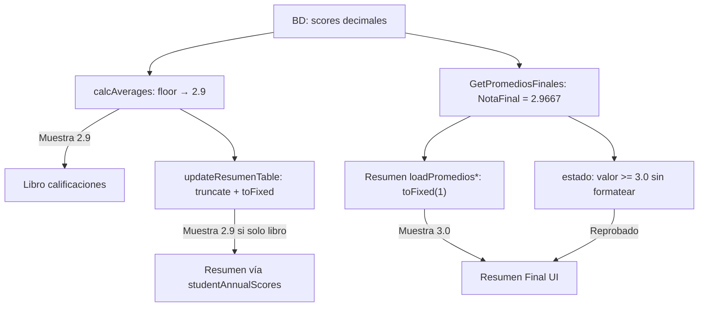

# Análisis: redondeo vs truncamiento en `/TeacherGradebook/Index`

**Fecha:** 2026-05-24  
**Alcance:** Solo visualización en `Views/TeacherGradebook/Index.cshtml` y datos que llegan desde `TeacherGradebookController`.  
**Modo:** Solo documentación. Sin cambios de código, notas, promedios ni reglas de aprobación.

---

## Conclusión ejecutiva

| Pregunta | Respuesta |
|----------|-----------|
| ¿Existe diferencia entre nota real y nota mostrada? | **Sí**, en varias zonas de la UI. |
| ¿La nota real (p. ej. 2.9667) se altera para reglas académicas? | **No.** Aprobado/Reprobado y `GetPromediosFinales` usan el valor numérico completo (`>= 3.0`). |
| ¿El problema del caso 2.9667 → "3.0" es visual o funcional? | **Principalmente visual** en el tab **Resumen Final**. La lógica marca **Reprobado** correctamente con 2.9667. |
| ¿Qué debería mostrarse según política de truncamiento? | **2.9** (`Math.floor(2.9667 × 10) / 10`). |
| ¿Qué muestra hoy el Resumen (API)? | **3.0** por `Number.prototype.toFixed(1)` (redondeo). |

**No existe** `TeacherGradebookService` en el proyecto. El controlador delega en `StudentActivityScoreService` y otros servicios; el **ViewModel** no formatea notas.

---

## Política esperada (referencia del análisis)

Truncar a un decimal (nunca redondear):

| Valor real | Mostrar |
|------------|---------|
| 2.9667 | 2.9 |
| 2.9999 | 2.9 |
| 3.8888 | 3.8 |
| 4.3999 | 4.3 |
| 4.9999 | 4.9 |

`toFixed(1)` en JavaScript aplica **redondeo** (p. ej. 2.9667 → `"3.0"`, 4.3999 → `"4.4"`), no truncamiento.

---

## Búsqueda solicitada (TeacherGradebook)

| Mecanismo | `TeacherGradebookController` | ViewModels | `Index.cshtml` |
|-----------|------------------------------|------------|----------------|
| `Math.Round()` | No | No | No (C# en vista) |
| `.ToString("N1")` / `"F1"` / `"0.0"` | No | No | No |
| `decimal.Round()` | No | No | No |
| `MidpointRounding` | No | No | No |
| `Format()` (notas) | No | No | Solo `Intl.DateTimeFormat` (fechas, ~1691, 3376) |
| **Redondeo visual** | No en respuestas JSON | `PromedioFinalDto` envía `decimal?` sin formato | **`toFixed(1)`** en múltiples puntos |
| **Truncamiento** | No | No | **`truncateToOneDecimal`**, **`Math.floor(x*10)/10`** en `calcAverages` |

Único uso C# de formato numérico en el controlador: `Console.WriteLine` con `{generalAverage:F2}` (línea ~762) — **no afecta la UI**.

---

## Caso reportado: robertwright68@gmail.com

### Docente

- **Email:** robertwright68@gmail.com  
- **Id:** `ee458ad2-90a1-4da7-b3d4-a12bc04ee7c3`  
- **Nombre:** ROBERTO WRIGHT  

### Estudiante de referencia (mismo caso forense previo)

- **Nombre:** Olea T, Eliany P  
- **Id:** `1e021123-9e7d-4d63-a81c-42c5d67d5a47`  
- **Materia / grupo:** CIENCIAS NATURALES — Ñ — 1T  

### Trazabilidad valor por valor

| Etapa | Valor | Truncamiento | Redondeo | Notas |
|-------|-------|--------------|----------|--------|
| **Notas almacenadas (BD)** | Por actividad (ej. aprec. 2.0–5.0, ejerc. 1.5–3.7, examen 2.8) | No aplica por celda | No | `student_activity_scores.score` sin redondeo de presentación |
| **Nota calculada (servicio)** | **2.966666…** | No en servicio | No | `GetPromediosFinalesAsync`: promedio de promedios por tipo |
| **Enviada al cliente (JSON)** | **2.966666…** | No | No | `PromedioFinalDto.NotaFinal` (`decimal?` crudo) |
| **ViewModel servidor** | N/A en Index | `TeacherGradebookViewModel` no incluye la nota en el HTML inicial | — |
| **Libro — columna final (JS)** | Calculada ~2.9667 internamente | **Sí** → **2.9** | `toFixed(1)` sobre valor ya truncado → **"2.9"** | `calcAverages()` ~2187–2214 |
| **Resumen — Promedio Final (JS)** | **2.966666…** del API | **No** | **Sí** → **"3.0"** | `loadPromediosFinales` / `loadPromediosFinalesResumen` |
| **Resumen — Estado** | Usa **2.966666…** | — | No en comparación | `promedioFinal >= 3.0` → **Reprobado** |

**Respuesta directa:** Para 2.9667, el sistema **debe y sí considera 2.9667** en reglas académicas; **solo la visualización del Resumen** muestra 3.0 por redondeo. El libro principal, si el usuario está en el grid del trimestre, mostraría **2.9** (truncado).

---

## Inventario detallado: dónde se trunca y dónde se redondea

### A. Truncamiento correcto (alineado con política)

| # | Archivo | Función / contexto | Líneas aprox. | Mecanismo | Uso |
|---|---------|-------------------|---------------|-----------|-----|
| 1 | `Index.cshtml` | `truncateToOneDecimal` | 1750–1758 | `Math.floor(num * 10) / 10` | Utilidad central de truncamiento |
| 2 | `Index.cshtml` | `loadNotasCargadas` → `scores[...]` | 2295 | `truncateToOneDecimal(nota.nota)` | Al cargar notas del servidor al mapa en memoria |
| 3 | `Index.cshtml` | `calcAverages` | 2187–2188 | `Math.floor(avg * 10) / 10` | Promedio por tipo de actividad |
| 4 | `Index.cshtml` | `calcAverages` | 2213–2214 | `Math.floor(finalGrade * 10) / 10` | Nota final del trimestre en fila |
| 5 | `Index.cshtml` | `updateResumenTable` | 1799, 1813 | `truncateToOneDecimal(promedio)` antes de pintar | Promedio **anual** cuando el resumen se alimenta de `studentAnnualScores` (tras `calcAverages`) |

Después del truncamiento, varias celdas usan `.toFixed(1)` sobre un valor **ya truncado** (p. ej. 2.9 → `"2.9"`). Eso **no cambia** el dígito mostrado respecto al truncamiento.

---

### B. Redondeo visual (`toFixed(1)`) — problema respecto a política

En JavaScript, `toFixed(1)` equivale a redondear al décimo más cercano (no a `Math.floor`).

| # | Archivo | Función / contexto | Líneas aprox. | Valor de entrada típico | Mostrado | ¿Afecta lógica académica? |
|---|---------|-------------------|---------------|-------------------------|----------|---------------------------|
| 1 | `Index.cshtml` | Render filas libro — celdas de nota | 1902 | `savedScore` (a menudo ya truncado en memoria) | `Number(savedScore).toFixed(1)` | **Visual**; puede redondear si el número en memoria no fue truncado |
| 2 | `Index.cshtml` | Blur celda editable | 1966 | Lo que escribe el docente | `numValue.toFixed(1)` | **Visual** al editar; el texto de la celda puede quedar redondeado antes de guardar |
| 3 | `Index.cshtml` | **`loadPromediosFinales`** — tab Resumen | 2376–2379 | **2.9667** (API) | **3.0** en Promedio Final; trimestres también con `toFixed` sin truncar | **No** en `estado` (línea 2368 usa valor bruto) |
| 4 | `Index.cshtml` | **`loadPromediosFinalesResumen`** | 4319–4322 | **2.9667** (API) | **3.0** | **No** en `estado` (línea 4305) |
| 5 | `Index.cshtml` | `updateResumenTable` — columnas 1T/2T/3T | 1810–1812 | Valores de `studentAnnualScores` (suelen ser **ya truncados** por `calcAverages`) | `toFixed(1)` | **Visual**; en la práctica suele coincidir con truncado si solo se usó el libro |
| 6 | `Index.cshtml` | Tab Consejería (otro submódulo) | 4457, 4470, 4487–4488 | Promedios de consejería | `toFixed(1)` | Fuera del libro/resumen principal; **visual** |

**Punto crítico del caso reportado:** filas **#3 y #4** — datos de `POST /TeacherGradebook/GetPromediosFinales` sin pasar por `truncateToOneDecimal`.

---

### C. Híbrido: truncamiento en cálculo + `toFixed` en pintado (libro)

| Paso | Línea aprox. | Comportamiento |
|------|--------------|----------------|
| Promedio tipo | 2191 | `truncAvg.toFixed(1)` tras `Math.floor` |
| Nota final fila | 2214 | `truncFinalGrade.toFixed(1)` tras `Math.floor` |

**Ejemplo 2.9667 en `calcAverages`:**  
`finalGrade = 2.966…` → `truncFinalGrade = 2.9` → pantalla **"2.9"**.  
**Coherente con política de truncamiento.**

---

## Flujo por pestaña de `/TeacherGradebook/Index`

---

## ¿Visual o funcional?

| Componente | Tipo | Explicación |
|------------|------|-------------|
| Comparación `>= 3.0` (Resumen, ~2368, 4305) | **Funcional (correcta)** | Usa el número real (2.9667), no el string "3.0". |
| `PromedioFinalDto.Estado` en servicio (~488) | **Funcional (correcta)** | `notaFinal.Value >= 3.0m` sobre decimal sin redondear. |
| Columna **Estado** "Reprobado" con nota mostrada "3.0" | **Inconsistencia UX** | Lógica correcta, **presentación engañosa**. |
| Columna **Promedio Final** en Resumen (API) | **Solo visual** | `toFixed(1)` redondea; no recalcula aprobación. |
| Columna **final-grade** en libro | **Visual alineada** | Trunca antes de mostrar. |
| Blur celda `toFixed(1)` (~1966) | **Visual (y posible texto guardado)** | Si el docente guarda, el **string** de la celda puede ser el redondeado; las notas en BD del caso Eliany son por actividad, no 2.9667 almacenado como nota única. |

**Veredicto:** La discrepancia **2.9667 vs 3.0** en el caso reportado es **únicamente visual** en el Resumen alimentado por API. **No** hace que el sistema apruebe o repruebe con una regla distinta: reprueba porque **2.9667 < 3.0**.

---

## Servicios y controlador (transporte, sin formateo UI)

| Componente | Formateo de notas |
|------------|-------------------|
| `TeacherGradebookController.GetPromediosFinales` | Devuelve JSON; sin `Round`/`ToString` en notas |
| `StudentActivityScoreService.GetPromediosFinalesAsync` | `NotaFinal` = promedio decimal sin truncar |
| `TeacherGradebookViewModel` | No contiene campos de nota formateados para el Resumen |
| `PromedioFinalDto` | Propiedades `decimal?`; serialización JSON numérica |

*(Otros servicios como `TeacherGradebookPdfService` usan `TruncateOneDecimal` con `Math.Floor`, pero están fuera del HTML de `Index`.)*

---

## Ejemplos de comportamiento `toFixed(1)` vs truncamiento

| Real | Truncar (política) | `toFixed(1)` (actual en Resumen API) |
|------|--------------------|--------------------------------------|
| 2.9667 | **2.9** | **3.0** ← caso Eliany |
| 2.9999 | **2.9** | **3.0** |
| 3.8888 | **3.8** | **3.9** |
| 4.3999 | **4.3** | **4.4** |
| 4.9999 | **4.9** | **5.0** |

---

## Resumen para corrección futura (solo referencia; no implementado)

Para alinear **solo visualización** con truncamiento, sin tocar 2.9667 en reglas ni BD:

1. Sustituir `promedioFinal.toFixed(1)` en `loadPromediosFinales` y `loadPromediosFinalesResumen` por el equivalente a `truncateToOneDecimal` + formato.
2. Revisar blur/render de celdas (1966, 1902) para no redondear al editar/mostrar actividades.
3. Mantener `>= 3.0` sobre el valor numérico real (sin cambio académico).

---

## Referencias cruzadas

- Análisis forense completo: `ANALISIS_ESTUDIANTE_REPROBADO_3_0.md`  
- SQL de validación: `Scripts/forensic_robertwright_gradebook.sql`  

---

*Documento generado en modo solo lectura. No se implementaron cambios.*
