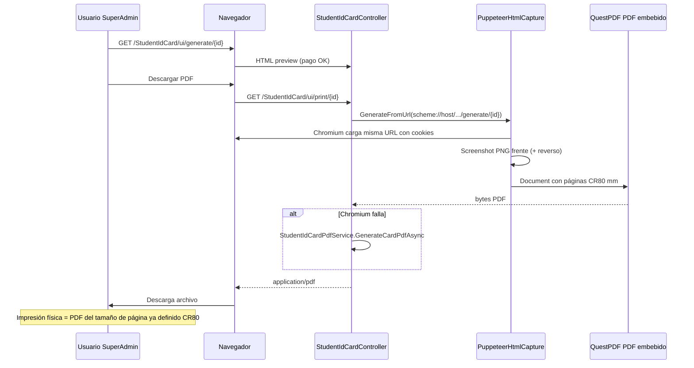

# Análisis del módulo actual de carnet estudiantil y base para credencial institucional del personal

**Ámbito:** código en `C:\Proyectos\EduplanerIIC\SchoolManager` (ASP.NET Core MVC).  
**Restricción:** este documento no modifica el sistema; el módulo `StudentIdCard` debe permanecer intacto.

---

## 1. Nombre enterprise recomendado para el nuevo módulo

| Candidato | Pros | Contras |
|-----------|------|---------|
| `/AdministratorIdCard/ui` | Explícito | Demasiado estrecho (excluye docentes, seguridad, staff). |
| `/StaffCredential/ui` | Corto, claro en inglés | “Staff” puede sonar informal en contexto LATAM. |
| `/InstitutionalCredential/ui` | Cubre todo rol no estudiantil; tono corporativo | Ruta larga. |
| `/PersonnelCard/ui` | RR.HH. estándar | Menos asociación a “credencial digital / QR”. |
| `/AcademicCredential/ui` | Premium | Ambiguo (podría confundirse con credencial de alumno). |

**Propuesta final:** **`InstitutionalCredential`** con rutas tipo **`/InstitutionalCredential/ui`** (controlador `InstitutionalCredentialController`, área opcional si más adelante se agrupa).

- **Escalable:** no ancla el producto a “administrador” ni solo a “docente”.
- **Profesional:** alineado a “employee / institutional badge” en entornos enterprise.
- **Limpio:** distinto de `StudentIdCard` en nombre, carpeta de vistas y contratos.

Alternativa aceptable si se prefiere español en URL: **`/CredencialInstitucional/ui`** (menos habitual en APIs y bookmarks internacionales).

---

## 2. Mapa del módulo actual `StudentIdCard`

### 2.1 Controlador

- **Archivo:** `Controllers/StudentIdCardController.cs`
- **Ruta base:** `[Route("StudentIdCard")]`
- **Autorización:** `[Authorize(Roles = "SuperAdmin,superadmin")]` — hoy solo SuperAdmin en UI.

**Rutas UI y API relevantes:**

| Método | Ruta | Función |
|--------|------|---------|
| GET | `StudentIdCard/ui` | Listado (vista `Index`). |
| GET | `StudentIdCard/ui/generate/{studentId}` | Vista previa HTML del carnet (no genera estado en GET). |
| GET | `StudentIdCard/ui/print/{studentId}` | PDF: captura HTML → PDF; fallback nativo. |
| GET | `StudentIdCard/ui/scan` | Página de escaneo. |
| POST | `StudentIdCard/api/generate/{studentId}` | Genera carnet + token QR (transacción). |
| POST | `StudentIdCard/api/print-bulk` | PDF masivo (merge con PdfSharpCore). |
| GET | `StudentIdCard/api/list-json`, `list-filters`, `list-ids` | DataTables / filtros. |
| POST | `StudentIdCard/api/scan` | Validación QR (AllowAnonymous + rate limit). |
| GET | `StudentIdCard/public/emergency-info` | Página pública firmada (segundo QR). |

### 2.2 Pay-gate (estudiantes)

El carnet estudiantil **no** referencia `ClubParents` en los archivos `StudentId*`. La condición de negocio es **`StudentPaymentAccesses.CarnetStatus == "Pagado"`**:

- `GenerateView`, `Print`, `GenerateApi` y `BuildEligibleStudentQuery` filtran por ese pago.
- `StudentIdCardService.GenerateAsync` valida pago dentro de transacción serializable.

**Implicación para el nuevo módulo:** el personal **no debe** consultar `StudentPaymentAccesses` ni reutilizar este pay-gate. Las credenciales institucionales deben gobernarse por **rol, permiso, estado laboral** y opcionalmente política escolar distinta.

### 2.3 Servicios

| Servicio | Responsabilidad |
|----------|-----------------|
| `StudentIdCardService` | Estado del carnet (`StudentIdCards`), tokens (`StudentQrTokens`), escaneo, DTO para UI. Requiere asignación activa y pago para generar. |
| `StudentIdCardPdfService` | Orquesta datos → bytes de imagen vía `IStudentIdCardImageService` → empaqueta en PDF con **QuestPDF** (páginas mm exactos CR80 o frente+reverso en una fila). Descarga logos/fotos con caché HTTP (`IHttpBytesDownloadCache` + `IFileStorageService.GetUserPhotoBytesAsync`). |
| `StudentIdCardImageService` | **SkiaSharp**: frente (clásico / moderno / vertical institucional / plantilla por campos), reverso con QR y texto. Usa `IQrSignatureService`. |
| `StudentIdCardHtmlCaptureService` | **PuppeteerSharp**: navega a la URL de preview, inyecta cookies de sesión, captura `#idCardFront` y segunda `.idcard-face` como PNG, redimensiona con SkiaSharp, arma PDF con QuestPDF (1–2 páginas CR80). Perfil `CardPrinter` ajusta DPR según bounding box. Fallback masivo: URL parseada → `GenerateCardPdfAsync`. |

### 2.4 Dimensiones CR80 y conversión mm → px

- **Archivo:** `Services/IdCardPhysicalDimensions.cs`
- CR80: **85.60 mm × 53.98 mm** (largo × corto).
- `RenderDpi = 300`: `LandscapeWidthPx/LandscapeHeightPx` y portrait intercambiando ejes.
- HTML en `Generate.cshtml` usa **aspect-ratio** y tamaños en px de pantalla (~210×334 vertical) para preview; la captura fuerza tamaño objetivo PDF en px según `StudentIdCardPdfPrintOptions` y `IdCardPhysicalDimensions`.

### 2.5 Configuración

- **`appsettings.json` → `StudentIdCard`:** `PublicBaseUrl` (QR emergencia absoluto).
- **`StudentIdCardPdf`:** `Profile` (`CardPrinter` / `A4Portrait`), `ContentScale`, `DeviceScaleFactor`, `MaxDeviceScaleFactor` (en código de captura).
- Registro en `Program.cs`: opciones + todos los servicios scoped del flujo carnet.

### 2.6 Modelo de datos

- **`Models/StudentIdCard.cs`:** `StudentId`, `CardNumber`, `IssuedAt`, `ExpiresAt`, `Status`, `IsPrinted`, `PrintedAt`.
- **`StudentQrTokens`**, **`ScanLog`** (vía servicio de escaneo).
- **`SchoolIdCardSetting`**, **`IdCardTemplateField`**, **`School`** (logo, teléfono, política carnet, etc.).
- **`User.PhotoUrl`** — foto del estudiante.

### 2.7 Vista previa HTML (`Views/StudentIdCard/Generate.cshtml`)

- Layout `_SuperAdminLayout`.
- Modelo `StudentIdCardGenerateViewModel` + `StudentIdCardDto` cuando hay carnet activo.
- Selectores críticos para Puppeteer: **`#idCardFront`**, **`.idcard-face`** (frente/reverso).
- Estilos inline extensos: colores desde settings, foto centrada, watermark, header institucional, grado-grupo compacto, reverso con QRs.
- **Descarga PDF:** `fetch` GET a `Print` con credenciales; valida `content-type` PDF.
- **Regenerar:** POST `/StudentIdCard/api/generate/{id}` con anti-forgery header.

### 2.8 Listado (`Views/StudentIdCard/Index.cshtml`)

- DataTables contra `/StudentIdCard/api/list-json`; enlace a `/StudentIdCard/ui/generate/{id}`; impresión masiva y estado impreso.

### 2.9 Flujo end-to-end `HTML Preview → Capture → PDF → Download → Print`



**Impresión:** no hay driver CR80 dedicado en código; la calidad depende del PDF de página fija y del perfil de impresora (100 % escala, sin márgenes). El perfil `CardPrinter` optimiza DPR para nitidez.

### 2.10 QuestPDF vs Puppeteer en la práctica

- **Primario para “pixel-perfect” con la vista:** Puppeteer + imágenes PNG + QuestPDF como contenedor de página.
- **Fallback:** `StudentIdCardImageService` (Skia) + QuestPDF — mismo tamaño mm, puede diferir sutilmente del HTML si la plantilla HTML diverge del renderer Skia.

### 2.11 Activos, logos, fotos, Cloudinary

- URLs en `School.LogoUrl`, `SchoolIdCardSetting.SecondaryLogoUrl`, `User.PhotoUrl`.
- Descarga acotada en tamaño/tiempo en `StudentIdCardPdfService`; caché documentada en `OPTIMIZACION_SEGURA_CLOUDINARY.md`.
- `IFileStorageService.GetUserPhotoBytesAsync` unifica local vs URL (p. ej. Cloudinary).

### 2.12 Rendimiento y memoria

- Cada captura: lanzamiento o reutilización de Chromium (bulk reutiliza un browser).
- PDF masivo: N capturas + merge en memoria — límite **30** estudiantes por operación.
- Imágenes grandes recortadas por política de descarga máxima.

### 2.13 Responsividad y compatibilidad impresión

- Preview con `max-width: 100%` y aspect-ratio fijo.
- Impresión CR80: el PDF ya viene en mm; el HTML es “aproximación visual” para pantalla.

---

## 3. Diseño visual propuesto (solo especificación — sin implementación)

**Objetivo:** credencial **premium enterprise**, claramente distinta del carnet estudiantil.

### 3.1 Frente (vertical CR80 por defecto)

- **Banda superior** más sobria que el carnet escolar: navy o color primario de la escuela con textura sutil (sin “juguete”).
- **Logo** institucional a la izquierda; a la derecha micro-texto “CREDENCIAL INSTITUCIONAL” / año fiscal o ciclo lectivo opcional (no “grado/grupo”).
- **Foto** rectangular con esquinas ligeramente redondeadas (estilo employee badge); borde fino metalizado o primario tenue.
- **Nombre completo** tipografía 600–700, tracking leve.
- **Tres líneas de identidad laboral** (sustituyen grado/grupo):
  1. **Rol de sistema** (p. ej. Docente, Director) — etiqueta pequeña “ROL”.
  2. **Cargo institucional** (p. ej. “Coordinador Académico”) — “CARGO”.
  3. **Departamento / área** — “ÁREA”.
- **Código institucional** (número de credencial o ID de empleado) monoespaciado.
- **QR principal** (verificación / acceso edificio) en esquina inferior; tamaño similar al estudiantil pero con marco más “corporativo”.

### 3.2 Reverso

- Política de uso, teléfono de seguridad, versión de credencial, QR secundario opcional (contacto interno o URL firmada **distinta** a emergencia de menores).
- **Sin** bloques de alergias/contacto emergencia **a menos** que política institucional lo exija para ciertos roles (configurable).

### 3.3 Diferencias claras vs carnet estudiantil

| Aspecto | Estudiantil | Institucional (propuesto) |
|---------|-------------|---------------------------|
| Identificación académica | Grado, grupo, jornada | Rol, cargo, departamento |
| Pay-gate | `StudentPaymentAccesses` | Ninguno ligado a club/pagos |
| Tono visual | Escuela / menor | Corporativo / universitario |
| Emergencia pública | QR firmado a página pública | Opcional o restringido por rol |

### 3.4 Preview HTML / PDF final

- Misma filosofía técnica: vista dedicada con `#idCardFront` + `.idcard-face` para un motor de captura **genérico** (ver plan de extracción compartida).
- PDF: mismas constantes físicas `IdCardPhysicalDimensions` para no romper impresoras CR80.

---

## 4. Arquitectura propuesta (alto nivel, desacoplada)

- **Nuevo controlador** `InstitutionalCredentialController` con rutas propias (`[Route("InstitutionalCredential")]`), autorización por roles ampliada + políticas.
- **Nuevos servicios:** `IInstitutionalCredentialService`, `IInstitutionalCredentialPdfService`, reutilizar **abstracción** de captura HTML→PDF (interfaz nueva que internamente delegue o copie política de `StudentIdCardHtmlCaptureService` sin acoplar nombres).
- **Nueva entidad** recomendada: p. ej. `StaffIdCard` o `InstitutionalCredential` (user id no estudiante, card number, issued, expires, printed flags) — **no** reutilizar tabla `student_id_cards`.
- **Settings:** tabla nueva `SchoolStaffIdCardSetting` o reutilizar `SchoolIdCardSetting` solo si se parametriza por “tipo de credencial” (riesgo de acoplamiento; preferible configuración separada).
- **DTO de render:** `StaffCardRenderDto` (RoleDisplay, JobTitle, Department, …) separado de `StudentCardRenderDto`.

---

## 5. Lista orientativa de archivos a crear / tocar (fase posterior)

**Crear (nuevo módulo):**

- `Controllers/InstitutionalCredentialController.cs`
- `Services/Interfaces/IInstitutionalCredential*.cs`
- `Services/Implementations/InstitutionalCredential*.cs`
- `Views/InstitutionalCredential/Index.cshtml`, `Generate.cshtml`, (opcional) `Scan.cshtml`
- `ViewModels/InstitutionalCredential*.cs`
- `Dtos/StaffCardRenderDto.cs` (o nombre acordado)
- `Models/InstitutionalCredentialCard.cs` + migración EF
- `Options/InstitutionalCredentialOptions.cs`, sección `appsettings`

**Extraer / compartir (refactor cuidadoso sin romper estudiantes):**

- Interfaz `ICardHtmlCaptureService` + implementación que reciba URL y selectores (o perfiles).
- `IdCardPhysicalDimensions` (ya compartido).
- Posible `CardPdfDocumentBuilder` para QuestPDF de páginas CR80 desde PNG.

**Tocar con mínimo riesgo:**

- `Program.cs` (DI + opciones)
- `Views/Shared/_SuperAdminLayout.cshtml` (menú jerárquico)
- Políticas de autorización si existen centralizadas

---

## 6. Riesgos detectados

1. **Duplicación vs regresión:** extraer captura PDF sin alterar firmas públicas de `StudentIdCardHtmlCaptureService`.
2. **Datos de cargo/departamento:** el modelo `User` actual **no** incluye departamento ni cargo explícitos — hace falta extensión de modelo o tabla de perfil laboral.
3. **Autorización:** hoy el carnet estudiantil es SuperAdmin; el institucional puede requerir `Director`, `Admin`, etc., con reglas distintas por escuela.
4. **Doble fuente de verdad de fotos:** mitigar con directorio de personal que solo llame a `IUserPhotoService` (ya existente).
5. **Chromium en hosting:** ya contemplado con fallback nativo; el nuevo módulo debe repetir la misma política de resiliencia.

---

## 7. Validación (checklist Fase 7)

- Roles y permisos acorde a política escolar.
- PDF/PNG/impresión CR80 con prueba física.
- QR con payload y expiración propios del personal.
- Sin consultas a `StudentPaymentAccesses` en flujos de personal.
- Pruebas de carga moderada en impresión masiva (límites análogos).

---

## 8. Referencias de código (anclajes)

Controlador y pay-gate:

```60:92:c:\Proyectos\EduplanerIIC\SchoolManager\Controllers\StudentIdCardController.cs
    [HttpGet("ui/generate/{studentId}")]
    public async Task<IActionResult> GenerateView(Guid studentId)
    {
        var student = await StudentRoleFilter.WhereIsStudent(_context.Users.AsNoTracking())
            // ...
                HasPaid = _context.StudentPaymentAccesses.Any(spa =>
                    spa.StudentId == u.Id && spa.CarnetStatus == "Pagado")
            })
            .FirstOrDefaultAsync();
        // ...
        if (!student.HasPaid)
        {
            _logger.LogWarning(
                "[StudentIdCard] GenerateView denegado: pago pendiente StudentId={StudentId}", studentId);
            return RedirectToAction(nameof(Index));
        }
```

Pipeline captura:

```33:55:c:\Proyectos\EduplanerIIC\SchoolManager\Services\Implementations\StudentIdCardHtmlCaptureService.cs
    public async Task<byte[]> GenerateFromUrl(string url)
    {
        var executablePath = await ResolveChromiumExecutablePath();
        // ...
        await using (var browser = await Puppeteer.LaunchAsync(launchOpts))
        {
            (frontImg, backImg) = await CaptureCardFacesAsync(browser, url);
        }
        return BuildPdfFromFaceImages(frontImg, backImg);
    }
```

Dimensiones físicas:

```6:16:c:\Proyectos\EduplanerIIC\SchoolManager\Services\IdCardPhysicalDimensions.cs
public static class IdCardPhysicalDimensions
{
    public const float LongMm = 85.60f;
    public const float ShortMm = 53.98f;
    public const float RenderDpi = 300f;
    // ...
}
```

---

## 9. Entregables cruzados

- Flujo de fotografías y directorio: ver **`ANALISIS_STAFF_DIRECTORY.md`** y **`PLAN_STAFF_DIRECTORY.md`**.
- Plan de implementación del carnet: **`PLAN_NEW_ADMINISTRATOR_CARD.md`**.
- Menú lateral propuesto: **`PLAN_NEW_ADMINISTRATOR_CARD.md`** sección menú (alineado con este documento).
