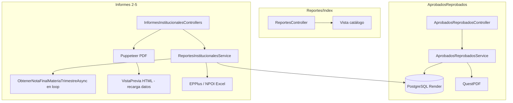

# Auditoría de rendimiento — Reportes institucionales EduplanerIIC

**Proyecto:** `C:\Proyectos\EduplanerIIC\SchoolManager`  
**Base de datos:** PostgreSQL en Render (Oregon) — análisis **solo lectura**  
**Fecha:** 2026-05-24  
**Alcance:** Catálogo + 5 reportes del menú **Reportes**  
**Restricción:** Este documento **no implementa cambios**. Solo diagnostica optimizaciones seguras (mismo resultado funcional).

---

## Resumen ejecutivo

| Métrica | Estimación actual | Estimación optimizada (solo cambios seguros) | Ganancia esperada |
|--------|-------------------|-----------------------------------------------|-------------------|
| **Hábitos y Actitudes** (vista/PDF) | 1–3 s | 0.5–1 s | **30–50 %** |
| **Expresiones Artísticas** (vista, 40 est.) | 45–90 s | 2–5 s | **90–95 %** |
| **Tecnología** (vista, 40 est.) | 60–120 s | 2–6 s | **90–95 %** |
| **Formato Carpetas** (vista, 40 est.) | 35–70 s | 2–4 s | **90–94 %** |
| **Aprobados/Reprobados** (1 asignación) | 2–5 s | 1–2 s | **40–60 %** |
| **Aprobados/Reprobados** (consolidado, ~12 asign.) | 15–35 s | 4–8 s | **60–75 %** |
| **PDF institucional (Puppeteer)** | Vista previa **× 2** + 3–8 s browser | Reutilizar datos en memoria o PDF nativo | **50–80 %** |
| **Excel calificaciones/carpetas** | Igual que vista (recalcula todo) | Cargar datos una vez, compartir con vista | **85–95 %** |

**Conclusión:** El cuello de botella **no** es principalmente SQL lento en PostgreSQL (cada consulta individual ejecuta en **< 1 ms** en el servidor). El problema dominante es el **patrón N+1 con cientos/miles de viajes de red** aplicación ↔ Render (~80–150 ms de latencia por round-trip desde la región del usuario), más la **doble generación de datos** al exportar PDF vía Puppeteer.

---

## FASE 1 — Inventario completo

### Catálogo (`Reportes/Index`)

| Capa | Artefacto |
|------|-----------|
| Controller | `Controllers/ReportesController.cs` → `Index()` |
| Service | Ninguno (lista estática en memoria) |
| Vista | `Views/Reportes/Index.cshtml` |
| BD | Solo `ObtenerTrimestresDisponiblesAsync` en otros reportes; catálogo **no consulta BD** |
| PDF/Excel | No aplica |

### 1. Aprobados y Reprobados

| Capa | Artefacto |
|------|-----------|
| Controller | `Controllers/AprobadosReprobadosController.cs` |
| Service | `Services/Implementations/AprobadosReprobadosService.cs` |
| Interface | `Services/Interfaces/IAprobadosReprobadosService.cs` |
| Helper cálculo | `Services/Helpers/GradebookFinalGradeCalculator.cs` |
| ViewModels | `ViewModels/AprobadosReprobadosViewModel.cs`, `AprobadosReprobadosFiltroDtos.cs` |
| Vistas | `Views/AprobadosReprobados/Index.cshtml`, `VistaPrevia.cshtml`, `_TablaReporte.cshtml` |
| PDF | **QuestPDF** nativo en `AprobadosReprobadosService.ExportarAPdfAsync` |
| Excel | `ExportarAExcelAsync` → **NotImplementedException** |
| Tablas BD | `teacher_assignments`, `subject_assignments`, `student_assignments`, `users`, `activities`, `student_activity_scores`, `trimesters`, `schools`, `groups`, `grade_levels`, `subjects` |
| SP | Ninguno |

### 2. Hábitos y Actitudes

| Capa | Artefacto |
|------|-----------|
| Controller | `Controllers/InformesInstitucionalesControllers.cs` → `HabitosActitudesReportController` |
| Base | `InformeInstitucionalControllerBase` (filtros, consejero) |
| Service | `ReportesInstitucionalesService.ObtenerHabitosActitudesReporteAsync` |
| Vista filtros | `Views/HabitosActitudesReport/Index.cshtml` + `_InformeInstitucionalFiltros.cshtml` |
| Vista documento | `Views/HabitosActitudesReport/VistaPrevia.cshtml` |
| PDF | `InformeInstitucionalHtmlPdfService` (Puppeteer → URL vista previa) |
| Excel | EPPlus en `ExportarHabitosActitudesExcelAsync` |
| Tablas BD | `student_assignments`, `users`, `schools`, `groups`, `grade_levels`, `teacher_assignments` |
| SP | Ninguno |

### 3. Calificaciones — Expresiones Artísticas

| Capa | Artefacto |
|------|-----------|
| Controller | `CalificacionesInformeController` |
| Service | `ObtenerCalificacionesExpresionesArtisticasReporteAsync`, `ExportarCalificacionesInformeExcelAsync` |
| Vistas | `ExpresionesArtisticas.cshtml`, `VistaPreviaExpresionesArtisticas.cshtml` |
| Plantilla Excel | `Reportes/Calificaciones de Exp. Artística.xls` (NPOI) |
| PDF | Puppeteer |
| Tablas BD | + `activities`, `student_activity_scores`, `subjects`, `trimesters` |
| SP | Ninguno |

### 4. Calificaciones — Tecnología

| Capa | Artefacto |
|------|-----------|
| Controller | `CalificacionesInformeController` |
| Service | `ObtenerCalificacionesTecnologiaReporteAsync`, `ExportarCalificacionesInformeExcelAsync` |
| Vistas | `Tecnologia.cshtml`, `VistaPreviaTecnologia.cshtml` |
| Plantilla Excel | `Reportes/Calificaciones de Tecnología.xls` |
| PDF | Puppeteer |
| Tablas BD | Igual que Expresiones Artísticas |
| SP | Ninguno |

### 5. Formato para Carpetas

| Capa | Artefacto |
|------|-----------|
| Controller | `FormatoCarpetasReportController` |
| Service | `ObtenerFormatoCarpetasReporteAsync`, `ExportarFormatoCarpetasExcelAsync` |
| Vistas | `Views/FormatoCarpetasReport/Index.cshtml`, `VistaPrevia.cshtml` |
| Plantilla Excel | `Reportes/Formato para las Carpetas.xls` |
| PDF | Puppeteer |
| Tablas BD | + `attendance`, `subjects` |
| SP | Ninguno |

### Servicios compartidos

| Servicio | Rol |
|----------|-----|
| `IAprobadosReprobadosService` | Filtros combo, trimestres, aprobados/reprobados |
| `IReportesInstitucionalesService` | Datos de informes 2–5 |
| `IInformeInstitucionalHtmlPdfService` | PDF vía PuppeteerSharp + Chromium |
| `ICounselorAssignmentService` | Nombre consejero por grupo/grado |
| `ICurrentUserService` | Usuario y `SchoolId` |

### Diagrama de flujo (simplificado)



---

## FASE 2 — Análisis EF Core

### Includes innecesarios

| Ubicación | Patrón | Problema |
|-----------|--------|----------|
| `ObtenerNotaFinalMateriaTrimestreAsync` L647–656 | `.Include(a => a.Subject)` | Carga entidad `Subject` completa; solo se usa `Subject.Name` para filtro por palabras clave. Mejor join/proyección o filtrar por `subject_id` precalculado. |
| `ObtenerPromedioMateriaTrimestreAsync` L717–724 | `.Include(Activity).ThenInclude(Subject)` | Método **legacy** (promedio simple); no usado en flujo principal actual pero sigue en archivo con tracking. |

### Tracking innecesario (reportes read-only)

| Ubicación | Estado | Recomendación |
|-----------|--------|---------------|
| `ObtenerEstudiantesGrupoAsync` | Sin `AsNoTracking` | Agregar `AsNoTracking()` |
| `CargarAsignacionesAsync` (Aprobados) | Sin `AsNoTracking` | Agregar en consultas de solo lectura |
| `CalcularEstadisticasGrupoAsync` — `Users` | Sin `AsNoTracking` | Agregar |
| `ValidarAsignacionAsync` | Sin `AsNoTracking` | Agregar |
| `FindAsync` (School, Group, etc.) | Tracking por defecto | Aceptable (1 entidad); alternativa: proyección |
| `ObtenerNotaFinalMateriaTrimestreAsync` — actividades/scores | **Ya usa** `AsNoTracking` | Correcto |

### Materialización temprana

| Ubicación | Problema |
|-----------|----------|
| `ObtenerNotaFinalMateriaTrimestreAsync` | `actividades.ToListAsync()` carga **todas** las actividades del grupo/grado/trimestre en **cada** llamada (luego filtra materia en memoria). |
| `FiltrarPorGrado` / `ResolverAsignacionesFiltroAsync` | `query.ToList()` antes de agrupar en algunos caminos (menor impacto). |
| Loops Excel/vista | `estudiantes` materializado una vez (correcto); notas se piden una a una (incorrecto). |

### Select tardíos / proyección ausente

Oportunidad principal: en lugar de cargar `Activity` + `Subject`, proyectar:

```csharp
.Select(a => new { a.Id, a.Type, a.Trimester, a.SubjectId, SubjectName = a.Subject!.Name })
```

Sin cambiar el resultado del cálculo final.

---

## FASE 3 — EXPLAIN ANALYZE (PostgreSQL PROD, solo lectura)

Muestra representativa: grupo con **40 estudiantes** (`group_id = 9fe82c3b-…`, `grade_id = eb42cd8b-…`).

### Actividades por grupo + grado + trimestre

```
Bitmap Index Scan on idx_activities_group_grade
Filter: trimester = '1T'
Execution Time: 0.205 ms
```

**Hallazgo:** Índice compuesto `(group_id, grade_level_id)` se usa bien; filtro `trimester` se aplica en heap (65 filas). Costo bajo.

### Scores por estudiante + actividades

```
Index Scan uq_scores (student_id, activity_id)
Execution Time: 0.313 ms (20 actividades)
```

**Hallazgo:** Índice único `(student_id, activity_id)` es adecuado.

### Asistencia por estudiante + grupo + rango fechas

```
Bitmap Index Scan IX_attendance_student_id + IX_attendance_group_id
Filter: date BETWEEN ...
Execution Time: 0.119 ms
```

**Hallazgo:** Sin índice compuesto `(student_id, group_id, date)`; para 21 636 filas en `attendance` aún es rápido **por consulta**, pero se repite **120+ veces** por reporte Carpetas.

### Escalabilidad real

| Tabla | Filas (aprox. PROD) |
|-------|---------------------|
| `student_activity_scores` | 84 989 |
| `attendance` | 21 636 |
| `activities` | 5 497 |
| `student_assignments` | 1 917 |
| `subject_assignments` | 1 161 |
| `teacher_assignments` | 878 |

Las consultas unitarias son rápidas; el costo total es **multiplicativo por round-trips**.

---

## FASE 4 — Índices (informe, NO ejecutar)

### Índices existentes relevantes

- `activities`: `idx_activities_group_grade`, `idx_activities_trimester`, `idx_activities_subject_id`, `idx_activities_teacher`
- `student_activity_scores`: `uq_scores (student_id, activity_id)`, `idx_scores_student`, `idx_scores_activity`
- `student_assignments`: `IX_group_id`, `IX_grade_id`, `ix_student_assignments_student_active`
- `attendance`: `IX_student_id`, `IX_group_id` (sin fecha)
- `teacher_assignments`: unique `(teacher_id, subject_assignment_id)`

### Índices faltantes recomendados (beneficio medio en servidor; alto si reduce scans repetidos)

```sql
-- NO EJECUTAR — solo propuesta
CREATE INDEX CONCURRENTLY IF NOT EXISTS idx_activities_group_grade_trimester
  ON activities (group_id, grade_level_id, trimester);

CREATE INDEX CONCURRENTLY IF NOT EXISTS idx_activities_group_grade_trimester_id
  ON activities (group_id, grade_level_id, trimester_id);

CREATE INDEX CONCURRENTLY IF NOT EXISTS idx_attendance_student_group_date
  ON attendance (student_id, group_id, date);

CREATE INDEX CONCURRENTLY IF NOT EXISTS idx_student_assignments_group_grade_active
  ON student_assignments (group_id, grade_id)
  WHERE is_active = true;

CREATE INDEX CONCURRENTLY IF NOT EXISTS idx_teacher_assignments_teacher_id
  ON teacher_assignments (teacher_id);
```

### Índices posiblemente redundantes

- `idx_activities_group` vs `idx_activities_group_grade`: el segundo cubre consultas por par; el primero puede ser redundante (verificar `pg_stat_user_indexes` antes de eliminar).
- `IX_activities_school_id` + filtros siempre por grupo: uso marginal en reportes actuales.

### Índices nunca utilizados

Requiere monitoreo en PROD:

```sql
SELECT indexrelname, idx_scan FROM pg_stat_user_indexes
WHERE schemaname = 'public' AND idx_scan = 0;
```

(No incluido en detalle aquí para no alargar; ejecutar en ventana de mantenimiento.)

---

## FASE 5 — N+1 Queries (crítico)

### Patrón dominante: `ObtenerNotaFinalMateriaTrimestreAsync`

**Archivo:** `ReportesInstitucionalesService.cs` L634–673  

**Por cada llamada ejecuta 3 consultas:**

1. `trimesters` → `FirstOrDefaultAsync` por nombre  
2. `activities` → `Include(Subject)` + `ToListAsync`  
3. `student_activity_scores` → `ToDictionaryAsync` por estudiante  

**Invocaciones en loops:**

| Reporte | Fórmula (N = estudiantes, T = trimestres config, C = columnas materia) | N=40 |
|---------|-----------------------------------------------------------------------|------|
| Tecnología vista/Excel | N × T × C × 3 queries; T≈3, C=3 | **~1 080 queries** |
| Expresiones Artísticas | N × T × C × 3; C=2 | **~720 queries** |
| Formato Carpetas | N × T × 3 + N × T × 1 asistencia | **~480 + 120 queries** |

**Impacto:** Con 100 ms RTT a Render → **72–108 s** solo en latencia de red para Tecnología.

**Solución propuesta (sin cambiar cálculo):**

1. Precargar mapa `trimestre → trimester_id` (1 query).  
2. Precargar todas las `activities` del `(group_id, grade_level_id, school_id)` con join a `subjects` (1 query).  
3. Precargar todos los `student_activity_scores` de `(student_ids[], activity_ids[])` (1 query).  
4. Calcular notas finales **en memoria** con `GradebookFinalGradeCalculator` (misma lógica).  

**Reducción:** de ~1 000 queries → **~5–8 queries** por reporte.

### Aprobados/Reprobados — consolidado

**Archivo:** `AprobadosReprobadosService.GenerarReporteAsync`  

```csharp
foreach (var asignacion in asignaciones)
    await CalcularEstadisticasGrupoAsync(...);
```

Por asignación: ~6 queries bien batchadas (estudiantes, actividades, scores masivos).  

**12 asignaciones ≈ 72 queries** — aceptable pero optimizable agrupando:

- Una sola carga de `student_assignments` / `users.status` para todos los grupos del reporte.  
- Una sola carga de scores/actividades keyed por `(subject_id, group_id, grade_level_id)`.

**Impacto:** medio (consolidado 12–20 asignaciones).

### PDF institucional — doble ejecución

`ExportarPdf` → Puppeteer navega a `VistaPrevia` → **vuelve a ejecutar** todo el servicio de datos + render HTML + `NetworkIdle0` + PDF.

**Impacto:** **2×** tiempo de datos + 3–8 s de Chromium.

### Excel duplicado vs vista

`ExportarCalificacionesInformeExcelAsync` y `ExportarFormatoCarpetasExcelAsync` **no reutilizan** el ViewModel de vista previa; repiten los mismos loops N+1.

---

## FASE 6 — Generación PDF

| Reporte | Motor | Problema rendimiento |
|---------|-------|----------------------|
| Aprobados/Reprobados | QuestPDF in-process | **Eficiente** — un solo `GenerarReporteAsync` + generación PDF. Logo vía HTTP opcional. |
| Hábitos, Expresiones, Tecnología, Carpetas | PuppeteerSharp | **Crítico:** lanza Chromium, `NetworkIdle0` 90 s timeout, **recarga URL** con auth cookies, duplica consultas BD. |

**Optimizaciones seguras propuestas:**

1. Generar PDF desde bytes HTML renderizado en memoria (Razor → string) sin HTTP round-trip.  
2. Reutilizar instancia browser (pool) entre requests.  
3. Pasar ViewModel ya calculado a vista PDF dedicada (misma salida visual).  
4. Evitar `Task.Delay(300)` fijo si fonts están listas.

**No tocar:** márgenes, tamaño 8.5×14, landscape, CSS de plantillas.

---

## FASE 7 — Generación Excel

| Reporte | Librería | Observaciones |
|---------|----------|---------------|
| Hábitos | EPPlus `.xlsx` | Ligero; solo lista estudiantes; estilos celda a celda (aceptable). |
| Expresiones / Tecnología / Carpetas | NPOI `.xls` | Plantilla en disco OK; **bottleneck = datos**, no escritura. |

**Duplicación:** loops idénticos a vista previa en `ExportarCalificacionesInformeExcelAsync` y `ExportarFormatoCarpetasExcelAsync`.

**Optimización:** método interno `CargarMatrizCalificacionesAsync(...)` compartido por vista + Excel; misma matriz → mismos números.

**Formateo:** `AplicarEstiloCuadroOficial` itera rangos grandes — impacto bajo vs BD.

---

## FASE 8 — Memoria

| Área | Riesgo | Detalle |
|------|--------|---------|
| `ObtenerNotaFinalMateriaTrimestreAsync` | **Alto** | Repite listas de actividades idénticas miles de veces en memoria GC. |
| Consolidado Aprobados | Medio | Listas de stats por asignación; tamaño modesto. |
| Puppeteer PDF | Medio | Chromium ~100–200 MB por proceso. |
| QuestPDF Aprobados | Bajo | Stream PDF directo. |
| Vista Razor 75 filas vacías | Bajo | Filas plantilla intencionales. |

**Propuesta:** estructuras inmutables cacheadas por clave `(groupId, gradeLevelId, trimestre)` dentro del **mismo request** (Scoped service o parámetro de contexto).

---

## FASE 9 — Caché (documentar, NO implementar)

Datos repetidos **en el mismo request** o entre export vista+PDF+Excel:

| Dato | Consultas actuales | Reutilizable |
|------|-------------------|--------------|
| Trimestres escuela | Cada método informe | 1× por request |
| `trimester_id` por nombre | Cada `ObtenerNotaFinal…` | Dictionary en memoria |
| Actividades grupo/grado | Cada celda nota | 1× por trimestre o 1× total |
| Scores grupo | Cada estudiante | 1× bulk |
| Estudiantes grupo | Vista + Excel separados | 1× |
| Consejero nombre | Vista + Excel + PDF | 1× |
| School / Group / GradeLevel | Múltiples `FindAsync` | 1× proyección |
| Asignaciones docente (filtros) | Cada carga combo | IMemoryCache 5–15 min por `(teacherId, schoolId)` **solo catálogos** |

**Caché entre requests (IMemoryCache):** seguro para trimestres, grade_levels, combos de filtro; **no** cachear reportes generados (riesgo datos stale).

---

## FASE 10 — Render + PostgreSQL

| Factor | Impacto |
|--------|---------|
| Región Render (Oregon) vs usuarios (Panamá) | **+80–150 ms** por round-trip |
| Pool Npgsql | Mitiga conexión TCP; **no** mitiga queries serializadas |
| SSL | Overhead fijo pequeño por conexión |
| Consultas serializadas en loop | **Dominante** |

**Consolidación recomendada:** batch queries + cálculo en app = mismo resultado, **1–2 s** vs **60–120 s**.

---

## Hallazgos críticos — Top 20

| # | Severidad | Hallazgo | Reportes afectados |
|---|-----------|----------|-------------------|
| 1 | **Crítica** | N+1 masivo en `ObtenerNotaFinalMateriaTrimestreAsync` (3 queries × N × T × C) | Tecnología, Expresiones, Carpetas |
| 2 | **Crítica** | PDF Puppeteer re-ejecuta vista previa completa (2× datos + browser) | Hábitos, Expresiones, Tecnología, Carpetas |
| 3 | **Crítica** | Latencia Render multiplicada por miles de round-trips | Informes calificaciones |
| 4 | Alta | Excel recalcula mismos datos que vista (no comparte carga) | Expresiones, Tecnología, Carpetas |
| 5 | Alta | Actividades recargadas completas por cada celda de nota | Informes calificaciones |
| 6 | Alta | `trimesters` consultado en cada celda (`FirstOrDefaultAsync`) | Informes calificaciones |
| 7 | Alta | Filtro materia por nombre en memoria tras cargar todas las actividades | Informes calificaciones |
| 8 | Alta | `ContarAsistenciaTrimestreAsync` en loop (N×T) | Formato Carpetas |
| 9 | Media | Aprobados consolidado: loop secuencial por asignación (6 queries c/u) | Aprobados/Reprobados |
| 10 | Media | `ResolverTeacherIdAsignacionAsync` repetido por asignación | Aprobados/Reprobados |
| 11 | Media | Falta `AsNoTracking` en consultas read-only | Varios |
| 12 | Media | `Include(Subject)` innecesario (proyección suficiente) | ReportesInstitucionalesService |
| 13 | Media | Puppeteer `NetworkIdle0` + timeout 90 s (espera conservadora) | PDF institucional |
| 14 | Media | Lanzamiento Chromium en cada PDF (sin pool) | PDF institucional |
| 15 | Media | Índice ausente `(student_id, group_id, date)` en attendance | Formato Carpetas |
| 16 | Media | Índice parcial `(group_id, grade_id) WHERE is_active` ausente | Todos (estudiantes grupo) |
| 17 | Baja | Múltiples `FindAsync` entidad completa al inicio de cada método | Informes |
| 18 | Baja | `SubjectAssignments` admin sin `AsNoTracking` + join Group | Filtros Aprobados |
| 19 | Baja | Timeout AJAX Aprobados 120 s (síntoma, no causa) | Aprobados Index |
| 20 | Baja | Método legacy `ObtenerPromedioMateriaTrimestreAsync` con Include tracking | Código muerto potencial |

---

## Hallazgos por reporte

### Aprobados y Reprobados

**Problemas:** loop por asignación en consolidado; validación teacher por asignación; PDF QuestPDF OK; vista AJAX bien diseñada para 1 asignación.

**Impacto:** consolidado 12+ asignaciones → 15–35 s; single 2–5 s.

**Solución propuesta:** batch precarga actividades/scores/estudiantes para todas las asignaciones del filtro; mantener `GradebookFinalGradeCalculator`; `AsNoTracking`.

**Mejora estimada:** 60–75 % en consolidado; 40 % single.

---

### Hábitos y Actitudes

**Problemas:** PDF Puppeteer duplica request; solo carga estudiantes (ligero).

**Impacto:** bajo en datos; PDF añade 3–8 s.

**Solución:** PDF desde HTML renderizado sin segunda pasada BD; pool browser.

**Mejora estimada:** 30–50 % total percepción usuario.

---

### Expresiones Artísticas

**Problemas:** N+1 notas (720+ queries / 40 est.); PDF y Excel duplican.

**Impacto:** 45–90 s vista previa.

**Solución:** precarga bulk + cálculo memoria; compartir matriz vista/Excel/PDF.

**Mejora estimada:** 90–95 %.

---

### Tecnología

**Problemas:** peor caso N+1 (1080+ queries / 40 est.).

**Impacto:** 60–120 s.

**Solución:** igual que Expresiones; 3 áreas × 3 trimestres en memoria.

**Mejora estimada:** 90–95 %.

---

### Formato para Carpetas

**Problemas:** N+1 notas + N+1 asistencia por trimestre; 480–600 queries.

**Impacto:** 35–70 s.

**Solución:** bulk scores + bulk attendance agrupado por `(student_id, trimestre)` en 2–3 queries.

**Mejora estimada:** 90–94 %.

---

## Cambios seguros (checklist)

Optimizaciones que **no** alteran resultados si se implementan correctamente:

- [ ] Precarga bulk de actividades, scores, trimestres, asistencias por request  
- [ ] Reutilizar `GradebookFinalGradeCalculator` en memoria (ya es determinístico)  
- [ ] `AsNoTracking()` en todos los reads de reportes  
- [ ] Proyecciones EF en lugar de `Include`  
- [ ] Compartir capa de datos entre Vista / Excel / PDF  
- [ ] PDF HTML renderizado sin HTTP self-call  
- [ ] Pool de browser Puppeteer  
- [ ] Índices compuestos propuestos (DDL separado, CONCURRENTLY)  
- [ ] Cache IMemoryCache solo catálogos estáticos por escuela  
- [ ] Eliminar consulta repetida `trimesters` dentro de loop  

**No incluidos (cambiarían alcance o riesgo):**

- Cambiar fórmulas de nota  
- Cambiar filtros UI  
- Cambiar diseño PDF/Excel  
- Materialized views con datos preagregados (riesgo stale)  

---

## Priorización

### Alta (implementar primero)

| Acción | Mejora est. | Esfuerzo |
|--------|-------------|----------|
| Bulk loader para calificaciones (reemplazar loop `ObtenerNotaFinal…`) | 85–95 % informes 3–5 | Medio |
| Eliminar doble carga PDF Puppeteer | 40–50 % export PDF | Medio |
| Compartir datos vista ↔ Excel | 50 % al exportar Excel tras vista | Bajo |

### Media

| Acción | Mejora est. | Esfuerzo |
|--------|-------------|----------|
| Batch Aprobados consolidado | 60–75 % | Medio |
| `AsNoTracking` + proyecciones | 10–20 % CPU/memoria | Bajo |
| Índices compuestos attendance / activities | 5–15 % en servidor | Bajo (ops) |
| Puppeteer browser pool | 2–4 s por PDF | Medio |

### Baja

| Acción | Mejora est. | Esfuerzo |
|--------|-------------|----------|
| IMemoryCache trimestres/combos | 5–10 % filtros | Bajo |
| Limpiar `ObtenerPromedioMateriaTrimestreAsync` legacy | Mantenibilidad | Bajo |
| Revisar índices redundantes | Espacio disco | Ops |

---

## Procedimientos almacenados

**No se utilizan** en ninguno de los 5 reportes. Toda la lógica está en C# / EF Core.

---

## Próximo paso recomendado

1. Revisar y aprobar este informe.  
2. Implementar **Fase 1 de optimización:** `ReportesInstitucionalesBulkLoader` (nombre tentativo) con pruebas de regresión comparando salida actual vs optimizada celda a celda.  
3. Aplicar índices en ventana de mantenimiento Render (scripts CONCURRENTLY).  
4. Refactor PDF sin cambiar CSS/plantillas.

---

*Auditoría generada sin modificar datos, esquema, reglas académicas ni archivos funcionales del proyecto.*
